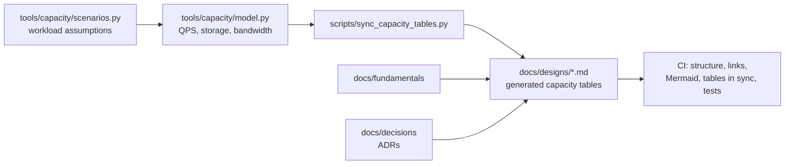

# System Design Architecture — Reference Designs and Capacity Models

[](https://github.com/shivkumarsinghsky/system-design-architecture/actions/workflows/ci.yml)


A system design knowledge base by **Shiv Kumar** covering twelve large-scale and enterprise systems — video
sharing, real-time messaging, social feeds, job portals, notifications, URL shortening, file storage, real-time
monitoring, e-commerce, multi-tenant SaaS and enterprise AI platforms.

Every design follows the same structure (requirements → capacity → architecture → API → data model →
caching, messaging, scaling, reliability, security, observability → trade-offs), uses Mermaid diagrams that
render on GitHub, and embeds **capacity estimates generated by a small, tested Python model** so the
assumptions behind every number are explicit and reproducible.

> These are **reference system designs inspired by publicly known product requirements**. They are not
> descriptions of any company's internal architecture, and the numbers are illustrative assumptions, not
> measurements.

## How the Repository Works



## Key Capabilities

- **12 reference designs** with a consistent, CI-enforced structure ([ADR-001](docs/decisions/ADR-001-standard-design-template.md)).
- **Capacity estimation as code** — change one assumption, regenerate every table ([ADR-002](docs/decisions/ADR-002-capacity-estimates-as-code.md)).
- **Fundamentals** — design method, scalability building blocks, consistency and messaging, reliability checklist.
- **Architecture Decision Records** for decisions that recur across designs (sagas, tenancy, diagrams as code).
- **Validated diagrams** — every Mermaid block is rendered in CI so broken diagrams never reach `main`.

## Design Catalogue

| # | Design | Main architecture themes |
|---|---|---|
| 01 | [Video Sharing Platform](docs/designs/01-video-sharing-platform.md) | Resumable uploads, transcoding pipeline, CDN, adaptive streaming |
| 02 | [Real-Time Messaging](docs/designs/02-real-time-messaging.md) | WebSocket gateways, per-conversation ordering, delivery receipts, presence |
| 03 | [Professional Network](docs/designs/03-professional-network.md) | Connection graph, feed ranking, search, recommendations |
| 04 | [Photo Sharing Social App](docs/designs/04-photo-sharing-social.md) | Fan-out on write vs. read, media pipeline, hot users |
| 05 | [Job Portal](docs/designs/05-job-portal.md) | Search indexing, matching, application workflow |
| 06 | [Notification System](docs/designs/06-notification-system.md) | Multi-channel delivery, preferences, rate limiting, retries |
| 07 | [URL Shortener](docs/designs/07-url-shortener.md) | Key generation, read-heavy caching, abuse prevention |
| 08 | [File Storage and Sync](docs/designs/08-file-storage.md) | Chunking, deduplication, metadata vs. blob storage, sync |
| 09 | [Real-Time Monitoring](docs/designs/09-real-time-monitoring.md) | Telemetry ingestion, stream processing, alerting, time-series storage |
| 10 | [E-Commerce](docs/designs/10-e-commerce.md) | Checkout saga, inventory reservation, flash-sale scaling |
| 11 | [Multi-Tenant SaaS](docs/designs/11-multi-tenant-saas.md) | Tenancy models, row-level security, entitlements, noisy neighbours |
| 12 | [Enterprise AI Platform](docs/designs/12-enterprise-ai-platform.md) | Permission-aware RAG, agent orchestration, guardrails, evaluation |

## Fundamentals

1. [A Repeatable Method for System Design](docs/fundamentals/01-design-method.md)
2. [Scalability Building Blocks](docs/fundamentals/02-building-blocks.md) — load balancing, caching, partitioning, replication
3. [Consistency and Messaging](docs/fundamentals/03-consistency-and-messaging.md) — CAP/PACELC, delivery semantics, outbox, ordering
4. [Reliability, Security and Observability Checklist](docs/fundamentals/04-reliability-patterns.md)

## Architecture

The repository has three layers:

| Component | Responsibility |
|---|---|
| `docs/designs/` | One document per system. Fixed section order, each with at least a high-level flowchart and a data model. |
| `tools/capacity/` | A dependency-free Python package. `Workload` captures assumptions (DAU, per-user rates, object sizes, retention, replication, peak factor); `estimate()` derives QPS, storage and bandwidth. |
| `scripts/` | Repository checks: capacity table sync, design structure (ADR-001) and internal link integrity. |

Data flows one way: **scenarios → model → generated tables in Markdown**. A design never contains a
hand-typed capacity number in its generated table, so the tables cannot drift from the assumptions.

## Technology Stack

| Area | Choice |
|---|---|
| Documentation | Markdown + Mermaid (rendered natively by GitHub) |
| Capacity model | Python 3.10+ standard library |
| Testing / linting | pytest, ruff |
| Diagram validation | `@mermaid-js/mermaid-cli` in CI |
| CI | GitHub Actions |

## Repository Structure

```text
system-design-architecture/
├── docs/
│   ├── designs/         # 12 reference system designs
│   ├── fundamentals/    # method and cross-cutting concepts
│   └── decisions/       # Architecture Decision Records
├── tools/capacity/      # capacity estimation package (model, scenarios, CLI)
├── scripts/             # sync_capacity_tables, check_design_structure, check_links
├── tests/               # pytest suite for the model, CLI and repository checks
└── .github/workflows/   # CI
```

## Getting Started

```bash
git clone https://github.com/shivkumarsinghsky/system-design-architecture.git
cd system-design-architecture
python3 -m venv .venv && source .venv/bin/activate
pip install -e ".[dev]"

# Print capacity estimates for every scenario, or one
python -m capacity --list
python -m capacity url-shortener
```

`pip install -e .` puts `tools/capacity` on the path; without installing, use `PYTHONPATH=tools python -m capacity`.

### Example output

```text
$ python -m capacity messaging
### Real-time messaging

| Metric | Estimate |
|---|---|
| Daily active users | 100,000,000 |
| Write QPS (avg / peak) | 46.3K/s / 138.9K/s |
...
```

## Changing an Assumption

1. Edit the relevant `Workload` in `tools/capacity/scenarios.py`.
2. Regenerate tables: `python scripts/sync_capacity_tables.py --write`.
3. Review the diff in the affected design and update any prose that depends on the numbers.

## Validation

There is no service to deploy; validation is static. The capacity estimator also runs in a container:
`docker compose run --rm capacity messaging`.

```bash
pytest                                      # unit tests for the model, CLI and checks
ruff check .                                # lint
python scripts/sync_capacity_tables.py      # fails if a generated table is stale
python scripts/check_design_structure.py    # enforces the design template
python scripts/check_links.py .             # fails on broken relative links / anchors
```

CI additionally renders every Mermaid diagram with `mermaid-cli` and fails on syntax errors.

## Scalability, Reliability, Security and Observability

These are covered per design (each document has dedicated sections) and summarised in the fundamentals:

- **Scalability:** horizontal scaling of stateless tiers, cache layers, partitioning keys derived from access
  patterns, asynchronous processing, read replicas → sharding ladder.
- **Reliability:** timeouts, retries with backoff and jitter, idempotency keys, outbox, dead-letter queues,
  circuit breakers, graceful degradation.
- **Security:** OIDC/OAuth2 at the edge, authorisation in the owning service, input validation, rate limiting,
  tenant isolation, secret management, prompt-injection controls for AI systems.
- **Observability:** RED/USE metrics, correlation ids through HTTP and message envelopes, SLO burn-rate alerting.

## Architecture Decisions

See [docs/decisions](docs/decisions/README.md):

- [ADR-001 — Standard template for every design](docs/decisions/ADR-001-standard-design-template.md)
- [ADR-002 — Capacity estimates generated from code](docs/decisions/ADR-002-capacity-estimates-as-code.md)
- [ADR-003 — Orchestrated saga for multi-service checkout](docs/decisions/ADR-003-saga-orchestration-for-checkout.md)
- [ADR-004 — Pooled tenancy with a placement table](docs/decisions/ADR-004-pooled-tenancy-with-placement.md)
- [ADR-005 — Diagrams as code with Mermaid](docs/decisions/ADR-005-diagrams-as-code-with-mermaid.md)

## Future Improvements

Not implemented yet:

- Cost estimation (compute/storage/egress cost per scenario) alongside capacity.
- Diurnal load curves instead of a single peak-to-average factor.
- Additional designs: payment ledger, distributed rate limiter, ride-hailing dispatch.
- C4 container diagrams for the designs that have runnable deep-dive repositories.

## Related Projects

Deep dives with runnable reference implementations of several designs:

- [Enterprise SaaS Platform](https://github.com/shivkumarsinghsky/enterprise-saas-plateform) — design 11
- [Enterprise AI Agent Platform](https://github.com/shivkumarsinghsky/enterprise-ai-agent-plateform) — design 12
- [RAG Enterprise Assistant](https://github.com/shivkumarsinghsky/rag-enterprise-assistant) — design 12
- [Real-Time Monitoring Platform](https://github.com/shivkumarsinghsky/realtime-monitoring-platform) — design 09
- [Video Sharing Platform](https://github.com/shivkumarsinghsky/youtub_plateform) — design 01
- [Real-Time Messaging Platform](https://github.com/shivkumarsinghsky/whatsapp_platform) — design 02
- [Social Media Platform](https://github.com/shivkumarsinghsky/socilmedia_platform) — designs 03 and 04
- [Job Portal](https://github.com/shivkumarsinghsky/job_portal) — design 05
- [Microservices Patterns](https://github.com/shivkumarsinghsky/microservices-patterns) — pattern catalogue used throughout
- [Event-Driven Platform](https://github.com/shivkumarsinghsky/event-driven-platform) — messaging, retries, DLQ, idempotency
- [EAM Platform Architecture](https://github.com/shivkumarsinghsky/eam-platform-architecture) — enterprise asset management domain

## Author

**Shiv Kumar** — Senior Software Engineer / Software Architect
GitHub: [github.com/shivkumarsinghsky](https://github.com/shivkumarsinghsky)

## License

[MIT](LICENSE)
