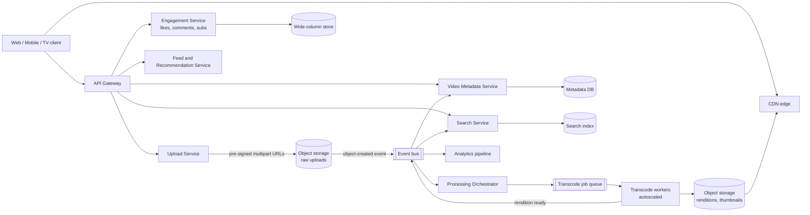
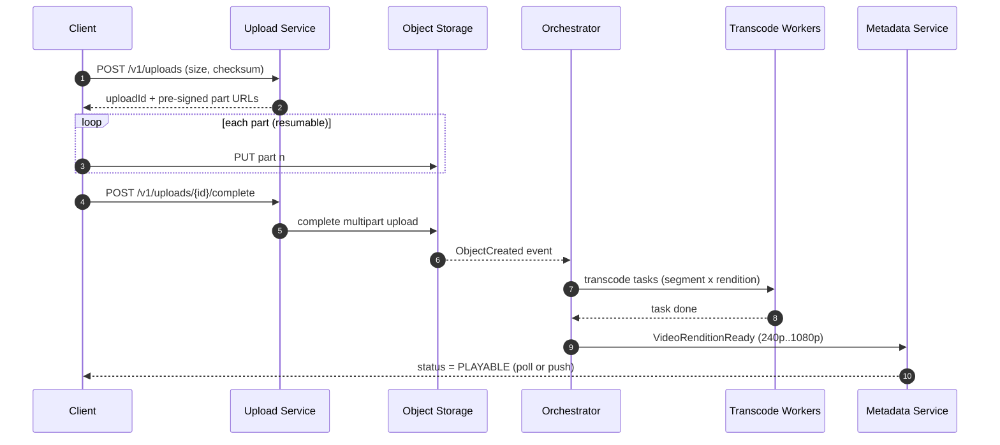
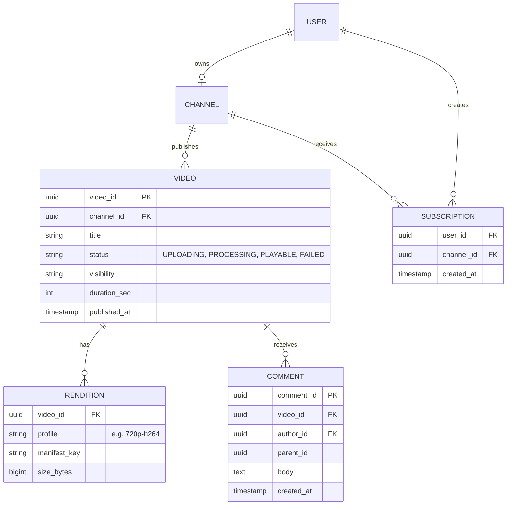

# Video Sharing Platform — Reference System Design

> Reference system design inspired by publicly known product requirements of video-sharing products.
> It is not a description of any company's internal architecture.

**Author:** Shiv Kumar · [GitHub](https://github.com/shivkumarsinghsky) ·
Deep dive with runnable code: [video-streaming-platform](https://github.com/shivkumarsinghsky/video-streaming-platform)

## Requirements

Design a platform where creators upload long-form video and viewers stream it on web, mobile and TV
clients at a quality that adapts to their network. The hard parts are **large uploads**, **asynchronous
media processing**, **global delivery** and the **very high read-to-write ratio**.

## Functional Requirements

- Creators upload videos (up to ~10 GB) with resumable uploads.
- Uploaded video is transcoded into multiple renditions (e.g. 240p–1080p) and packaged for adaptive
  streaming (HLS/DASH). Thumbnails are generated.
- Viewers stream video with adaptive bitrate and can seek.
- Channels, subscriptions, likes, comments and view counts.
- Search by title/description/tags; a home feed with recommendations.
- Creators see basic analytics (views, watch time).

Out of scope: live streaming, monetisation, content-ID matching.

## Non-Functional Requirements

| Concern | Target |
|---|---|
| Availability (playback) | 99.95% — playback matters more than upload |
| Playback start latency | < 2 s p95 (first segment from CDN edge) |
| Upload durability | No acknowledged upload is lost (11 nines object storage) |
| Processing latency | Video playable in SD within minutes; HD can follow |
| Consistency | View/like counters may be eventually consistent (seconds–minutes) |
| Scale | Read-heavy (~1000:1 views to uploads) |

## Capacity Estimation

Generated by `python -m capacity video-sharing` (see [tools/capacity](../../tools/capacity)). Assumptions: 50M DAU,
1% upload one video/day, ~300 MB stored per video across renditions, 10 views per user per day.

<!-- capacity:video-sharing:start -->
| Metric | Estimate |
|---|---|
| Daily active users | 50,000,000 |
| Write QPS (avg / peak) | 6/s / 17/s |
| Read QPS (avg / peak) | 5.8K/s / 17.4K/s |
| Read:write ratio | 1000:1 |
| New data per day | 150.0 TB |
| Stored data (1825 days, RF=3) | 821.2 PB |
| Ingress (avg) | 13.9 Gbps |
| Egress (avg / peak) | 2.3 Tbps / 6.9 Tbps |
<!-- capacity:video-sharing:end -->

What the numbers tell us:

- **Write QPS is tiny; bytes are huge.** Upload metadata fits in a single relational cluster, but
  storage grows by ~150 TB/day, so object storage with lifecycle tiering is mandatory.
- **Egress in the terabits/second range** cannot be served from origin. A CDN with a high cache-hit
  ratio (popular content is heavily skewed) is the core of the delivery architecture.
- Transcoding is CPU/GPU-bound and bursty → it belongs on an autoscaled worker pool fed by a queue.

## High-Level Architecture



**Upload path.** The client asks the Upload Service for an upload session. The service returns pre-signed
multipart URLs so the bytes go **directly to object storage**, never through application servers. On
completion the object store emits an event; the orchestrator creates a processing job.

**Processing path.** The orchestrator splits the source into segments (e.g. 10 s GOP-aligned chunks), fans
out transcode tasks per (segment × rendition), then packages manifests. Chunked transcoding parallelises
a 2-hour video across many workers and makes retries cheap — a failed task retries one segment, not the file.

**Playback path.** The client fetches the manifest and segments from the CDN. Origin is object storage
behind an origin shield, so a cache miss at many edges becomes one origin request.



## API Design

```http
POST   /v1/uploads                         # create resumable upload session
PUT    {pre-signed-url}                    # client uploads part directly to storage
POST   /v1/uploads/{uploadId}/complete     # finalize; idempotent
GET    /v1/videos/{videoId}                # metadata + processing status + manifest URL
PATCH  /v1/videos/{videoId}                # title, description, visibility
GET    /v1/channels/{channelId}/videos?cursor=...
POST   /v1/videos/{videoId}/likes          # idempotent per (user, video)
POST   /v1/videos/{videoId}/comments
GET    /v1/videos/{videoId}/comments?cursor=...&sort=top
POST   /v1/channels/{channelId}/subscriptions
GET    /v1/search?q=...&cursor=...
GET    /v1/feed/home?cursor=...
POST   /v1/videos/{videoId}/views          # batched heartbeat events, not one call per view
```

Cursor-based pagination is used everywhere; offset pagination degrades on large, constantly changing lists.

## Data Model



| Data | Store | Why |
|---|---|---|
| Video/channel metadata | Relational (PostgreSQL), sharded by `channel_id` later | Transactions on status changes, modest volume |
| Media bytes | Object storage + CDN | Cheap, durable, HTTP range reads |
| Comments, likes, subscriptions | Wide-column (Cassandra-style) keyed by `video_id` / `user_id` | High write volume, simple access patterns |
| View counters | Stream aggregation → counter store | Exact per-event writes would hot-spot popular videos |
| Search | Inverted index (OpenSearch/Elasticsearch) | Full-text + ranking |

## Caching

- **CDN** for segments, manifests and thumbnails; long TTLs because renditions are immutable
  (new edits produce new keys).
- **Origin shield** tier to collapse cache misses.
- **Metadata cache** (Redis) for hot video pages; invalidated by `VideoUpdated` events.
- **Counter cache**: view counts displayed from a periodically refreshed aggregate, not from the raw stream.

## Messaging

- Object-created events start processing; `VideoRenditionReady`, `VideoPublished`, `VideoViewed`
  events drive search indexing, notifications, analytics and recommendations.
- A durable log (Kafka-style) is used for high-volume `VideoViewed` streams; a work queue
  (SQS/RabbitMQ-style) with visibility timeouts is used for transcode tasks.

## Scaling

- Stateless API services scale horizontally behind the gateway.
- Transcode workers autoscale on queue depth; spot/preemptible capacity is acceptable because tasks
  are small and idempotent.
- Metadata DB: read replicas first, then shard by `channel_id` when write volume or size requires it.
- Hot-video protection: request coalescing at the CDN and in the metadata cache.

## Reliability

- Resumable multipart upload; `complete` is idempotent on `uploadId`.
- Processing tasks are idempotent (output key derived from `videoId + segment + profile`) and retried
  with backoff; poison tasks go to a dead-letter queue and mark the video `FAILED` with a reason.
- Degrade gracefully: if recommendations are down, the home feed falls back to subscriptions/popular.
- Multi-region object storage replication for media; metadata DB with cross-region replica for DR.

## Security

- OAuth2/OIDC for users; short-lived pre-signed URLs scoped to one object and one HTTP method.
- Signed CDN URLs/cookies for private or unlisted videos.
- Upload validation: size limits, content-type sniffing, malware scanning, transcode in sandboxed workers.
- Rate limiting on upload creation, comments and likes; abuse/spam classification asynchronously.

## Observability

- RED metrics per API; queue depth and task age for the processing pipeline.
- Player-side QoE metrics: startup time, rebuffer ratio, bitrate switches (sampled).
- Distributed tracing from upload completion through processing using the `videoId` as a correlation key.
- SLO alerts on "time from upload complete to playable".

## Trade-offs

| Decision | Benefit | Cost |
|---|---|---|
| Direct-to-storage uploads | App tier never handles bytes | More complex client; pre-signed URL management |
| Chunked parallel transcoding | Fast, cheap retries | Orchestration complexity, segment stitching |
| Eventually consistent counters | Removes hot-row contention | Counts lag by seconds/minutes |
| Pre-transcode all renditions | Instant playback at any quality | Storage cost for rarely watched videos (mitigate: transcode high renditions on demand for the long tail) |

Related: [Notification System](06-notification-system.md) · [File Storage](08-file-storage.md) ·
[Photo Sharing](04-photo-sharing-social.md)
