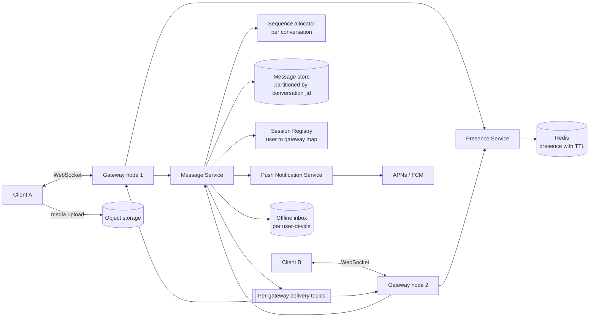
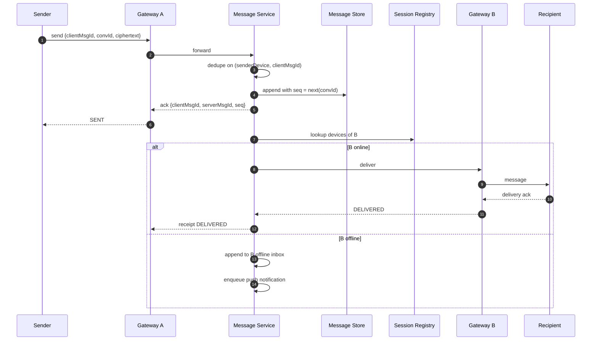
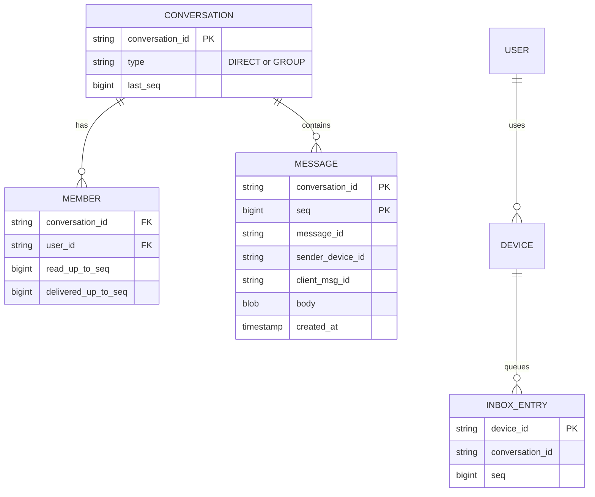

# Real-Time Messaging Platform — Reference System Design

> Reference system design inspired by publicly known product requirements of mobile messaging apps.
> It is not a description of any company's internal architecture.

**Author:** Shiv Kumar · [GitHub](https://github.com/shivkumarsinghsky) ·
Deep dive with runnable code: [whatsapp_platform](https://github.com/shivkumarsinghsky/whatsapp_platform)

## Requirements

Design a messaging service supporting one-to-one and group chats on mobile and web, with delivery and read
receipts, presence and media. The defining problems are **long-lived connections at scale**, **routing a
message to whichever server holds the recipient's connection**, **per-conversation ordering** and
**exactly-once user experience over at-least-once transport**.

## Functional Requirements

- 1:1 and group messaging (groups up to ~1,000 members).
- Message states: sent (server accepted) → delivered (reached device) → read.
- Offline delivery: messages queued until the recipient reconnects; push notification when offline.
- Presence (online / last seen) and typing indicators.
- Media (images, video, documents) via object storage.
- Multi-device: a user may be connected on phone and web simultaneously.

## Non-Functional Requirements

| Concern | Target |
|---|---|
| Delivery latency (both online) | < 200 ms p95 within a region |
| Durability | An acknowledged message is never lost |
| Ordering | Total order **per conversation**; no global order needed |
| Duplicates | Clients never display a duplicate (dedupe by client message id) |
| Availability | 99.99% for send/receive |
| Privacy | End-to-end encryption is supported by design (server routes ciphertext) |

## Capacity Estimation

Generated by `python -m capacity messaging`. Assumptions: 100M DAU, 40 messages sent per user per day,
~200 bytes per message envelope (media stored separately), 30-day server-side retention.

<!-- capacity:messaging:start -->
| Metric | Estimate |
|---|---|
| Daily active users | 100,000,000 |
| Write QPS (avg / peak) | 46.3K/s / 138.9K/s |
| Read QPS (avg / peak) | 46.3K/s / 138.9K/s |
| Read:write ratio | 1:1 |
| New data per day | 800.0 GB |
| Stored data (30 days, RF=3) | 72.0 TB |
| Ingress (avg) | 74.1 Mbps |
| Egress (avg / peak) | 74.1 Mbps / 222.2 Mbps |
<!-- capacity:messaging:end -->

Additional estimate — **concurrent connections**: if 30% of DAU are connected at peak, that is 30M WebSocket
connections. At ~50K–100K connections per gateway node (memory-bound), that is roughly 300–600 gateway nodes.
Connection count, not message QPS, sizes the gateway fleet.

## High-Level Architecture



**Gateways** hold WebSocket connections and nothing else: authentication on connect, heartbeat, and
forwarding frames. They are stateless apart from the sockets they hold, which keeps deploys simple
(drain connections, clients reconnect elsewhere).

**Session registry** maps `userId/deviceId → gatewayId` with a TTL refreshed by heartbeats. The message
service looks up recipients and publishes to each gateway's delivery topic; the gateway pushes to the socket.

**Message service** owns the write path: dedupe, sequence assignment, persistence, fan-out.



## API Design

WebSocket frames (JSON shown; production would use a binary protocol such as protobuf):

```json
{ "type": "send", "clientMsgId": "01J...", "conversationId": "c_42", "body": "<ciphertext>", "sentAt": 1717000000 }
{ "type": "ack", "clientMsgId": "01J...", "messageId": "m_9", "seq": 1042 }
{ "type": "message", "conversationId": "c_42", "messageId": "m_9", "seq": 1042, "from": "u_1", "body": "<ciphertext>" }
{ "type": "receipt", "conversationId": "c_42", "upToSeq": 1042, "status": "READ" }
{ "type": "sync", "conversationId": "c_42", "afterSeq": 1030 }
```

REST for non-realtime operations:

```http
POST /v1/conversations                       # create group
POST /v1/conversations/{id}/members
GET  /v1/conversations/{id}/messages?afterSeq=1030&limit=100
POST /v1/media                               # returns pre-signed upload URL
GET  /v1/users/{id}/presence
```

Receipts use **high-water marks** (`upToSeq`) rather than one receipt per message — one frame acknowledges
everything up to a sequence number.

## Data Model



The message table is partitioned by `conversation_id` and clustered by `seq`, which makes "give me messages
after seq N" a single-partition range scan. A wide-column store fits this access pattern well.

## Caching

- Session registry and presence in Redis with TTLs (presence = key exists; expiry = offline).
- Recent messages per active conversation cached for fast sync after brief disconnects.
- Group membership cached at the message service (invalidated on membership events).

## Messaging

- Each gateway subscribes to its own delivery channel (Redis pub/sub for low latency, or a log for
  durability). Delivery to the gateway can be at-most-once **because the message is already persisted** —
  a missed push is recovered by the client's `sync afterSeq` on reconnect.
- Large-group fan-out is done asynchronously by fan-out workers, not on the send path.

## Scaling

- Gateways scale by connection count; use consistent connection draining during deploys.
- Message store partitions by conversation; very large groups are the hot-partition risk, mitigated by
  sub-partitioning by time bucket.
- Sequence allocation: per-conversation counter co-located with the partition leader (or a conditional
  update), so it does not become a global bottleneck.
- Presence is the noisiest feature; throttle updates (e.g. only publish transitions and coalesce typing events).

## Reliability

- **At-least-once + idempotency = effectively-once UX.** Clients retry `send` with the same `clientMsgId`;
  the server dedupes on `(senderDeviceId, clientMsgId)` and returns the original `seq`.
- Gap detection: clients notice `seq` gaps and issue `sync`.
- Heartbeats with timeouts detect dead connections; registry TTL cleans stale routes.
- Push notification failures are retried but never block delivery to online devices.

## Security

- Device-bound auth tokens; authenticate the WebSocket upgrade, re-validate on token expiry.
- End-to-end encryption concepts: per-device identity keys, session keys established out of band
  (Signal-protocol style); the server stores and routes ciphertext only and cannot read message bodies.
- Group membership checks on every send; rate limits per device to contain spam.
- Media encrypted client-side; the object key and decryption key travel inside the encrypted message.

## Observability

- Metrics: connected sockets per gateway, send→deliver latency histogram, inbox depth, push success rate.
- Trace ID per message (`messageId`) across gateway → message service → gateway.
- Synthetic probe clients sending messages between regions continuously.

## Trade-offs

| Decision | Benefit | Cost |
|---|---|---|
| Per-conversation ordering only | Horizontal scalability | No cross-conversation ordering guarantee |
| Persist before deliver | No loss on gateway crash | Adds a write to the latency path |
| Pub/sub to gateways (lossy) + client sync | Low latency, simple | Requires robust client gap handling |
| Server stores ciphertext (E2EE) | Privacy | No server-side search or moderation of content |

Related: [Notification System](06-notification-system.md) · [Professional Network](03-professional-network.md)
