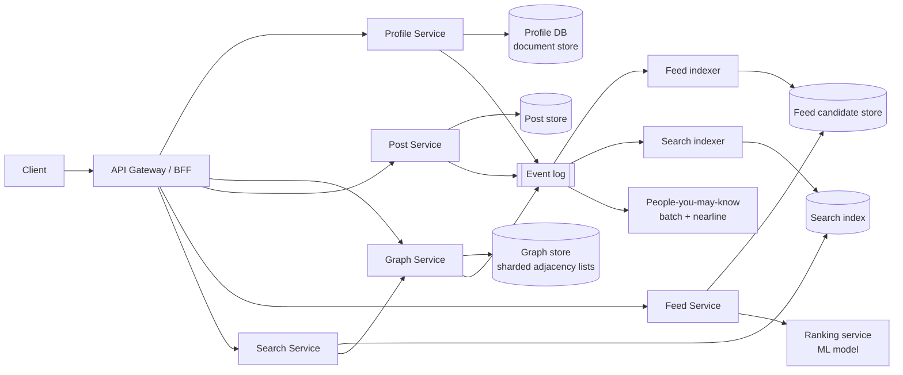
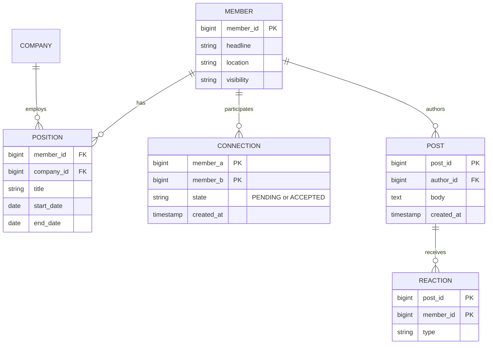

# Professional Networking Platform — Reference System Design

> Reference system design inspired by publicly known product requirements of professional networking sites.
> It is not a description of any company's internal architecture.

**Author:** Shiv Kumar · [GitHub](https://github.com/shivkumarsinghsky) ·
Related deep dive: [socilmedia_platform](https://github.com/shivkumarsinghsky/socilmedia_platform)

## Requirements

Design a professional network with member profiles, a connection graph, a content feed, and search over
people and companies. The interesting problems are the **social graph** (degree-of-connection queries),
**feed ranking** and **people search with privacy rules**.

## Functional Requirements

- Member profiles (experience, skills, education) and company pages.
- Connections (mutual, request/accept) and follows (one-way).
- Post, comment, react; a ranked home feed.
- People search with 1st/2nd/3rd-degree labels; "people you may know".
- Notifications for connection requests, reactions and mentions.

## Non-Functional Requirements

| Concern | Target |
|---|---|
| Feed latency | < 300 ms p95 for the first page |
| Profile reads | < 100 ms p95 |
| Graph queries (degree label) | < 50 ms p95 |
| Consistency | Own posts/profile edits visible to the author immediately (read-your-writes) |
| Availability | 99.95% |

## Capacity Estimation

Generated by `python -m capacity professional-network`. Assumptions: 30M DAU, 0.5 writes and 20 feed loads per
user per day, ~2 KB per post, ~30 KB per hydrated feed page (no media bytes).

<!-- capacity:professional-network:start -->
| Metric | Estimate |
|---|---|
| Daily active users | 30,000,000 |
| Write QPS (avg / peak) | 174/s / 521/s |
| Read QPS (avg / peak) | 6.9K/s / 20.8K/s |
| Read:write ratio | 40:1 |
| New data per day | 30.0 GB |
| Stored data (3650 days, RF=3) | 328.5 TB |
| Ingress (avg) | 2.8 Mbps |
| Egress (avg / peak) | 1.7 Gbps / 5.0 Gbps |
<!-- capacity:professional-network:end -->

Graph size: with ~500M members and an average of ~300 connections, there are ~75B directed edges.
At ~16 bytes per edge (two 64-bit ids) that is ~1.2 TB before indexes and replication — it fits on a
sharded graph store, and the hot portion (active members) fits in memory.

## High-Level Architecture



- **Graph Service** stores adjacency lists sharded by member id. 2nd-degree computation for search labels
  uses set intersection of the viewer's 1st-degree set (cached) with the target's 1st-degree set, rather
  than a full traversal.
- **Feed Service** gathers candidates (posts from connections/follows, plus recommended content), then calls a
  ranking model. Candidate generation uses the hybrid fan-out approach described in
  [Photo Sharing](04-photo-sharing-social.md#high-level-architecture).
- **Search** combines an inverted index (name, title, skills, company) with graph distance as a ranking feature
  and privacy filtering (profile visibility settings) applied before results are returned.

## API Design

```http
GET    /v1/members/{id}                       # profile (fields filtered by viewer's access)
PATCH  /v1/members/me
POST   /v1/connections/requests               # { toMemberId, note }
POST   /v1/connections/requests/{id}/accept
GET    /v1/members/{id}/connections?cursor=...
GET    /v1/members/{id}/distance              # 1, 2, 3, or OUT_OF_NETWORK relative to viewer
POST   /v1/posts
GET    /v1/feed?cursor=...
GET    /v1/search/people?q=...&company=...&cursor=...
```

## Data Model



Connections are stored **twice** (A→B and B→A) in the graph store so each member's adjacency list is a single
shard read. The relational form above is the logical model; physically each direction lives on the owner's shard.

## Caching

- 1st-degree sets of active members cached in memory (compressed bitmaps or sorted id arrays).
- Profile cache keyed by `(memberId, viewerAccessLevel)` because visible fields depend on the viewer.
- Feed first page cached for a short TTL; invalidated when the viewer posts (read-your-writes).

## Messaging

- `PostCreated`, `ConnectionAccepted`, `ProfileUpdated` events on a partitioned log keyed by member id.
- Consumers: feed indexer, search indexer, notification service, PYMK pipeline, analytics.

## Scaling

- Shard graph and profile data by member id; replicate hot shards for reads.
- Precompute 2nd-degree candidates for PYMK offline; compute exact distance labels online with cached sets.
- Feed ranking is the dominant CPU cost; keep candidate sets bounded (e.g. top 500 by recency/affinity).

## Reliability

- Graph writes go through a single owner per edge pair to avoid split-brain states (A accepted, B pending).
- If ranking times out, fall back to recency-ordered candidates (graceful degradation).
- Search index rebuildable from the event log (log is the source of truth for derived views).

## Security

- Field-level authorization on profiles (public / connections / private).
- Anti-scraping: rate limits per member and IP, anomaly detection on profile view patterns.
- Privacy: search results respect blocking and visibility; "who viewed my profile" honours anonymous mode.

## Observability

- Feed: candidate count, ranking latency, fallback rate. Graph: shard hot-spot metrics.
- Business SLOs: connection acceptance end-to-end latency, notification delivery lag.

## Trade-offs

| Decision | Benefit | Cost |
|---|---|---|
| Duplicate edge storage | Single-shard adjacency reads | 2× storage, dual-write consistency |
| Set-intersection distance | Fast, bounded | Only exact to 2nd degree; 3rd degree is approximated |
| Hybrid feed fan-out | Bounded write amplification | Two code paths to maintain |
| Viewer-dependent caching | Correct privacy | Lower cache hit ratio |

Related: [Job Portal](05-job-portal.md) · [Photo Sharing](04-photo-sharing-social.md) ·
[Notification System](06-notification-system.md)
