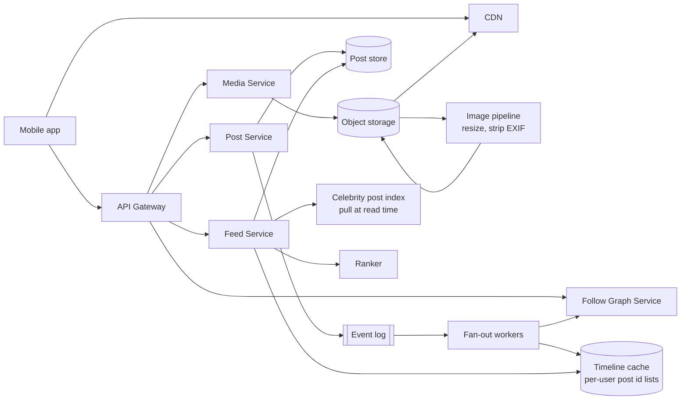
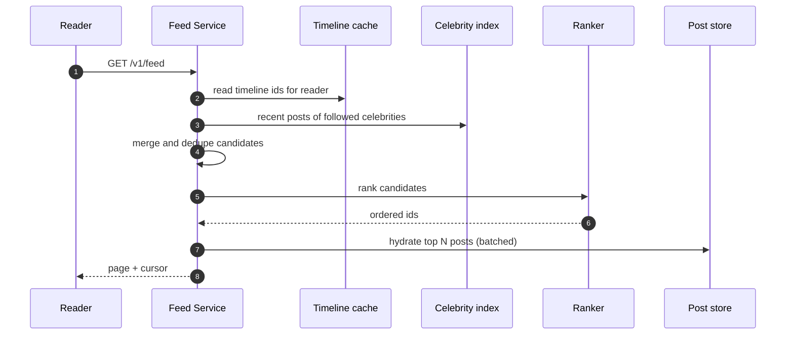
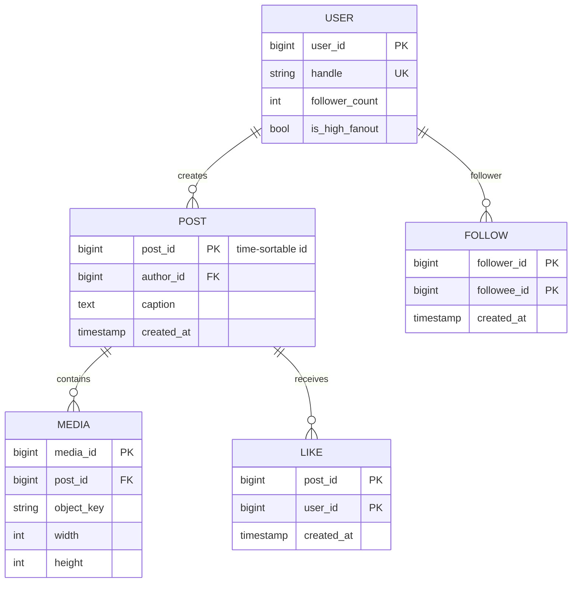

# Photo Sharing Social App — Reference System Design

> Reference system design inspired by publicly known product requirements of photo-sharing social apps.
> It is not a description of any company's internal architecture.

**Author:** Shiv Kumar · [GitHub](https://github.com/shivkumarsinghsky) ·
Deep dive with runnable feed code: [social-media-platform](https://github.com/shivkumarsinghsky/social-media-platform)

## Requirements

Design a mobile-first social app where users post photos, follow each other and scroll a home feed.
The central problem is **feed generation** for a follower graph with extreme skew (most accounts have
hundreds of followers; a few have tens of millions), plus serving **media at very high read volume**.

## Functional Requirements

- Upload photo posts with captions; view a user's profile grid.
- Follow / unfollow (one-way, asymmetric).
- Home feed of posts from followed accounts (ranked), infinite scroll.
- Likes and comments with counts.
- Notifications for follows, likes and comments.

## Non-Functional Requirements

| Concern | Target |
|---|---|
| Feed load | < 200 ms p95 for the first page (excluding image download) |
| Image load | Served from CDN, < 100 ms p95 time to first byte at the edge |
| Post visibility | A new post appears in followers' feeds within seconds (eventual consistency is fine) |
| Availability | 99.95% for reads; writes may degrade briefly |

## Capacity Estimation

Generated by `python -m capacity photo-sharing`. Assumptions: 200M DAU, 0.1 posts per user per day,
~2 MB stored per post (original plus resized variants), 50 image views per user per day at ~200 KB each.

<!-- capacity:photo-sharing:start -->
| Metric | Estimate |
|---|---|
| Daily active users | 200,000,000 |
| Write QPS (avg / peak) | 231/s / 694/s |
| Read QPS (avg / peak) | 115.7K/s / 347.2K/s |
| Read:write ratio | 500:1 |
| New data per day | 40.0 TB |
| Stored data (3650 days, RF=3) | 438.0 PB |
| Ingress (avg) | 3.7 Gbps |
| Egress (avg / peak) | 185.2 Gbps / 555.6 Gbps |
<!-- capacity:photo-sharing:end -->

Fan-out estimate: ~231 posts/s average × average 300 followers ≈ **70K feed inserts/s**. A single
account with 50M followers posting once would by itself generate 50M inserts — this is why pure
fan-out-on-write breaks down for celebrity accounts.

## High-Level Architecture



### Hybrid fan-out

- **Fan-out on write (push)** for normal accounts: when a post is created, fan-out workers prepend the
  post id to each follower's timeline list (capped, e.g. last 800 ids).
- **Fan-out on read (pull)** for high-follower accounts (above a threshold such as 100K followers):
  their posts are *not* pushed. At read time the feed service merges the reader's precomputed timeline
  with recent posts from the celebrities they follow.
- Inactive users (not opened the app in N days) are skipped during push; their timeline is rebuilt on
  next login.



## API Design

```http
POST   /v1/media/uploads                # pre-signed URL for the original image
POST   /v1/posts                        # { mediaIds[], caption }, Idempotency-Key header
GET    /v1/users/{id}/posts?cursor=...
POST   /v1/users/{id}/follow
DELETE /v1/users/{id}/follow
GET    /v1/feed?cursor=...
POST   /v1/posts/{id}/likes
GET    /v1/posts/{id}/comments?cursor=...
```

## Data Model



Post ids are time-sortable (Snowflake-style: timestamp + worker id + sequence), so timelines can be merged
by id without fetching timestamps.

## Caching

- Timeline cache (Redis lists/sorted sets) is the core data structure; it is a **derived view** that can be
  rebuilt from the follow graph and post store.
- Post object cache for hydration; like/comment counts cached and updated asynchronously.
- CDN for all image variants with immutable keys.

## Messaging

- `PostCreated` → fan-out workers, search indexing, notifications.
- `Followed` / `Unfollowed` → backfill or prune the follower's timeline.
- `PostLiked` → aggregated counter updates and notification batching ("X and 20 others liked your post").

## Scaling

- Fan-out workers scale on lag; partition the event log by author id.
- Shard post store by post id, follow graph by follower id (for "who do I follow") with a reverse index by
  followee id (for "who follows me" during fan-out).
- Tune the celebrity threshold from metrics: it trades write amplification against read-time merge cost.

## Reliability

- Fan-out is idempotent (timeline insert is a set-add by post id).
- If the timeline cache is lost, rebuild on demand from the last N posts of followed accounts.
- Image pipeline retries with DLQ; the post is published only when at least one variant is ready.

## Security

- Strip EXIF location data from uploads by default.
- Private accounts: follow requests require approval; feed and media URLs check follow relationship.
- Abuse controls: rate limits on follows/likes, spam and nudity classifiers in the media pipeline.

## Observability

- Fan-out lag (post created → present in follower timelines), timeline cache hit ratio, feed latency
  broken down by candidate gathering vs ranking vs hydration.

## Trade-offs

| Approach | Strength | Weakness |
|---|---|---|
| Fan-out on write | Very fast reads | Write amplification; wasted work for inactive followers |
| Fan-out on read | Cheap writes | Slow, expensive reads for users following many accounts |
| Hybrid (chosen) | Bounded cost on both paths | Two paths, threshold tuning, merge logic |

Related: [Professional Network](03-professional-network.md) · [Video Sharing](01-video-sharing-platform.md) ·
[Notification System](06-notification-system.md)
