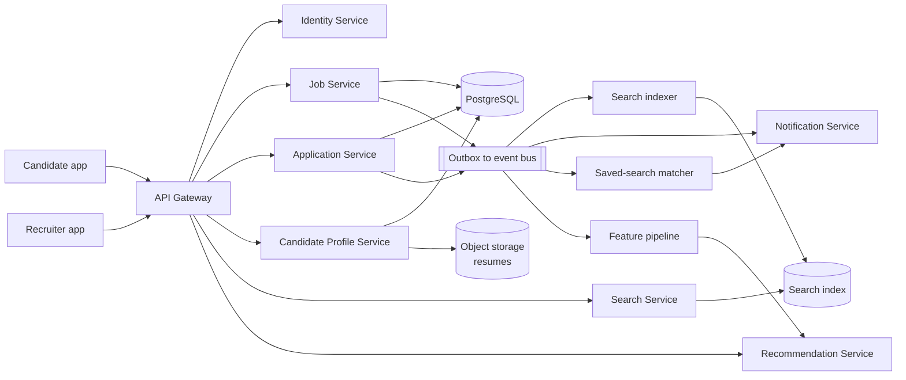
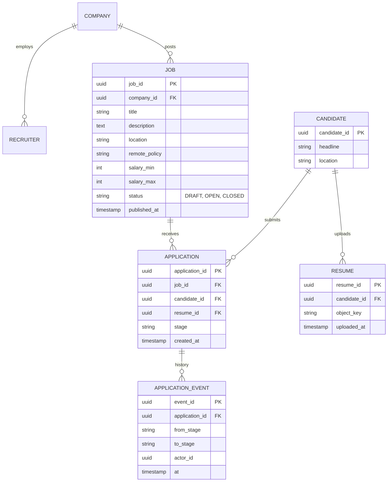

# Job Portal — Reference System Design

> Reference system design inspired by publicly known product requirements of job boards and applicant
> tracking products. It is not a description of any company's internal architecture.

**Author:** Shiv Kumar · [GitHub](https://github.com/shivkumarsinghsky) ·
Deep dive with runnable code: [job-portal-platform](https://github.com/shivkumarsinghsky/job-portal-platform)

## Requirements

Design a job marketplace connecting candidates, recruiters and companies. The interesting problems are
**search relevance with structured filters**, **keeping the search index fresh**, **recommendations**
and **handling personal data (resumes) responsibly**.

## Functional Requirements

- Companies and recruiters post jobs (title, description, location, remote policy, salary band, skills).
- Candidates build profiles, upload resumes, search jobs and apply.
- Application pipeline for recruiters: applied → screening → interview → offer → hired / rejected.
- Saved searches with alerts; recommended jobs for candidates and recommended candidates for recruiters.
- Notifications (email/in-app) on status changes.

## Non-Functional Requirements

| Concern | Target |
|---|---|
| Search latency | < 300 ms p95 including facets |
| Index freshness | New/closed jobs reflected in search within ~1 minute |
| Application durability | Submitted application never lost; exactly one application per (candidate, job) |
| Privacy | Resume access restricted to recruiters of the job applied to; GDPR-style deletion |
| Availability | 99.9% |

## Capacity Estimation

Generated by `python -m capacity job-portal`. Assumptions: 5M DAU, 0.3 writes and 15 search/detail reads per user
per day, ~5 KB per write record (resume files stored separately in object storage).

<!-- capacity:job-portal:start -->
| Metric | Estimate |
|---|---|
| Daily active users | 5,000,000 |
| Write QPS (avg / peak) | 17/s / 52/s |
| Read QPS (avg / peak) | 868/s / 2.6K/s |
| Read:write ratio | 50:1 |
| New data per day | 7.5 GB |
| Stored data (2555 days, RF=3) | 57.5 TB |
| Ingress (avg) | 694.4 Kbps |
| Egress (avg / peak) | 138.9 Mbps / 416.7 Mbps |
<!-- capacity:job-portal:end -->

This is a modest transactional load: a primary relational database with read replicas handles it. Search
and recommendations, not the OLTP database, are where engineering effort goes.

## High-Level Architecture



- **Job Service / Application Service** are the system of record (PostgreSQL). Writes use the
  [transactional outbox](https://github.com/shivkumarsinghsky/microservices-patterns) so the search index and
  notifications never miss a change.
- **Search Service** queries an inverted index with BM25 text scoring, filters (location, remote, salary,
  seniority) and boosts (recency, sponsored, candidate's skills).
- **Saved-search matcher** runs *percolation*: when a job is indexed, it is matched against stored queries,
  rather than re-running every saved search on a schedule.
- **Recommendations** combine content similarity (skills, title embeddings) with behavioural signals
  (views, applies) — content-based first, collaborative signals once there is enough data.

## API Design

```http
POST   /v1/companies/{companyId}/jobs
PATCH  /v1/jobs/{jobId}                         # edit or close
GET    /v1/jobs/{jobId}
GET    /v1/jobs/search?q=platform+engineer&location=Bengaluru&remote=true&minSalary=...&cursor=...
POST   /v1/jobs/{jobId}/applications            # Idempotency-Key; unique (candidate, job)
GET    /v1/me/applications
GET    /v1/jobs/{jobId}/applications?stage=SCREENING     # recruiter only
POST   /v1/applications/{applicationId}/transitions      # { to: "INTERVIEW", note }
POST   /v1/me/saved-searches
GET    /v1/me/recommendations/jobs
```

## Data Model



A unique constraint on `(job_id, candidate_id)` enforces one application per job at the database level —
retries and double-clicks cannot create duplicates.

## Caching

- Job detail pages cached (Redis/CDN for anonymous traffic) and invalidated by `JobUpdated` events.
- Search result caching only for popular anonymous queries; personalised queries are not cached.
- Facet counts for broad queries cached briefly (seconds).

## Messaging

- `JobPublished`, `JobClosed`, `ApplicationSubmitted`, `ApplicationStageChanged` via outbox → event bus.
- Consumers are idempotent by event id; the indexer uses the job's `version` to drop out-of-order updates.

## Scaling

- Stateless services behind the gateway; read replicas for candidate/recruiter dashboards.
- Search cluster scaled by shards (index size) and replicas (query throughput).
- Partition application tables by `job_id` hash if a single recruiter's high-volume jobs become hot.

## Reliability

- Outbox guarantees index/notification consistency without distributed transactions.
- If search is down, job detail and application flows continue; search page shows a degraded message.
- Recommendation service has a timeout and falls back to "recent jobs matching your title".

## Security

- Roles: candidate, recruiter, company admin, platform admin. Recruiters see applications only for their
  company's jobs (row-level authorization).
- Resumes stored encrypted; downloaded via short-lived signed URLs; virus scanned on upload.
- PII minimisation in the search index (no contact details indexed); right-to-erasure workflow propagates
  deletion via events.

## Observability

- Search: zero-result rate, click-through rate, latency per query shape. Freshness lag (DB commit → indexed).
- Funnel metrics: search → view → apply conversion, stage transition times.

## Trade-offs

| Decision | Benefit | Cost |
|---|---|---|
| PostgreSQL + separate search index | Right tool per access pattern | Eventual consistency; reindex tooling needed |
| Percolation for alerts | Real-time alerts, no batch sweeps | Stored-query index must be managed |
| Content-based recommendations first | Works without behavioural history | Lower relevance than hybrid models at scale |

Related: [Professional Network](03-professional-network.md) · [Notification System](06-notification-system.md)
