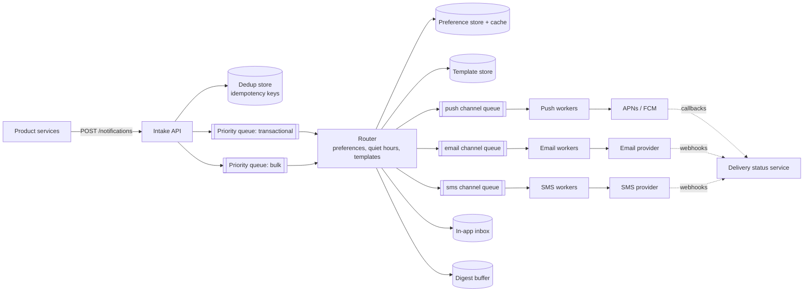
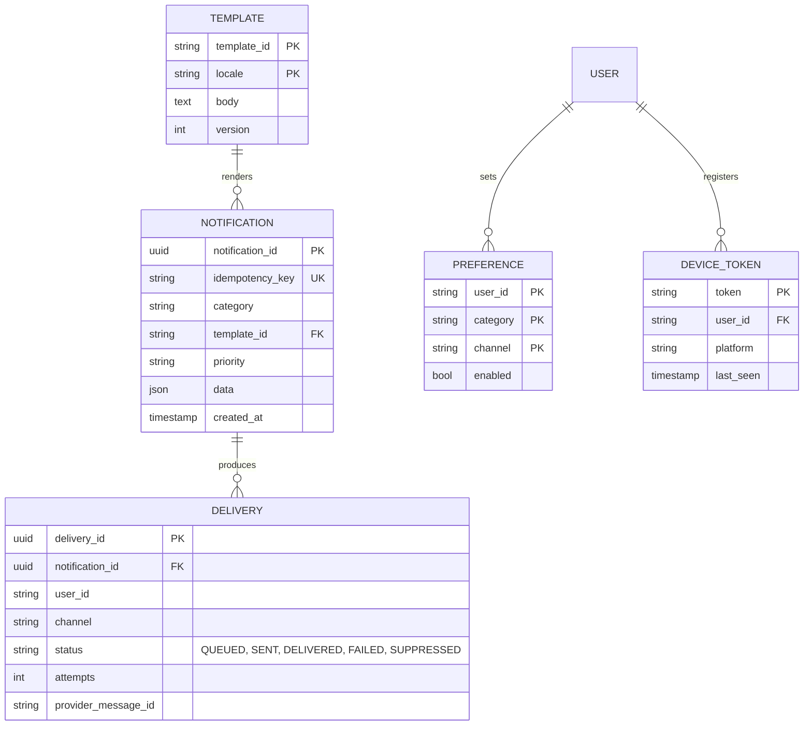

# Notification System — Reference System Design

> Reference system design for a multi-channel notification platform, inspired by publicly known
> product requirements. It is not a description of any company's internal architecture.

**Author:** Shiv Kumar · [GitHub](https://github.com/shivkumarsinghsky)

## Requirements

Build a shared platform service that other product teams call to notify users across **push, email, SMS
and in-app** channels. The difficulties are **burst absorption**, **user preferences and quiet hours**,
**deduplication**, **per-provider rate limits** and **not spamming people when something retries**.

## Functional Requirements

- Producers submit a notification intent: recipient(s), template id, data, priority, channels allowed.
- Template rendering with localisation.
- User preferences: per-category opt-in/out per channel, quiet hours, digest preference.
- In-app inbox with read/unread state.
- Delivery tracking: accepted → sent to provider → delivered / bounced / failed.
- Scheduled and digest (batched) notifications.

## Non-Functional Requirements

| Concern | Target |
|---|---|
| Transactional latency (e.g. OTP) | < 5 s end-to-end p95 |
| Marketing/bulk | Throughput-oriented; may be delayed by minutes |
| Duplicates | A logical notification is delivered at most once per channel |
| Availability of intake API | 99.99% — producers must not block on downstream providers |
| Isolation | A bulk campaign must not delay OTPs |

## Capacity Estimation

Generated by `python -m capacity notification`. Assumptions: 50M users, 10 notifications per user per day,
peak-to-average of 5× for campaign bursts.

<!-- capacity:notification:start -->
| Metric | Estimate |
|---|---|
| Daily active users | 50,000,000 |
| Write QPS (avg / peak) | 5.8K/s / 28.9K/s |
| Read QPS (avg / peak) | 2.9K/s / 14.5K/s |
| Read:write ratio | 1:2 |
| New data per day | 500.0 GB |
| Stored data (90 days, RF=3) | 135.0 TB |
| Ingress (avg) | 46.3 Mbps |
| Egress (avg / peak) | 115.7 Mbps / 578.7 Mbps |
<!-- capacity:notification:end -->

The peak write rate (tens of thousands per second) is driven by bursts, so the intake path must be a
durable buffer and delivery workers must drain at the rate providers allow.

## High-Level Architecture



- **Intake** validates, dedupes (on the producer-supplied idempotency key), persists, and returns `202`.
  It does not call providers.
- **Separate queues per priority and per channel** isolate failure domains: an email provider outage does
  not block push; a 10M-recipient campaign does not delay OTPs.
- **Channel workers** apply provider-specific rate limits (token buckets), retries with exponential backoff
  and jitter, and circuit breakers per provider. Failed messages beyond the retry budget go to a DLQ.
- **Digest buffer** collects low-priority notifications and emits one summary per user per window.

## API Design

```http
POST /v1/notifications
Idempotency-Key: order-123-shipped
{
  "recipients": ["u_1"],
  "category": "order_updates",
  "template": "order_shipped",
  "data": { "orderId": "123", "eta": "2026-01-10" },
  "priority": "transactional",
  "channels": ["push", "email"]
}
-> 202 { "notificationId": "n_abc" }

GET  /v1/notifications/{notificationId}             # status per channel
GET  /v1/users/{userId}/inbox?cursor=...
POST /v1/users/{userId}/inbox/{id}/read
PUT  /v1/users/{userId}/preferences
```

## Data Model



## Caching

- User preferences and device tokens cached (high read rate, low change rate); invalidated on update.
- Rendered templates are not cached per user, but compiled templates are cached per version.

## Messaging

- Durable queues with per-message visibility timeouts for workers; partitioned logs for status events.
- Delivery is at-least-once to the worker; **the dedupe key `(notificationId, userId, channel)` is checked
  before calling the provider** to avoid duplicate sends after worker crashes.

## Scaling

- Workers scale per channel on queue lag; provider rate limits cap useful parallelism.
- Fan-out of bulk campaigns (segment → users) happens in a separate batch expander that writes to the bulk
  queue in chunks, never in the intake request.

## Reliability

- Retries with exponential backoff + jitter; retry only on retryable errors (timeouts, 429, 5xx).
- Circuit breaker per provider; optional failover to a secondary provider for SMS/email.
- Invalid device tokens (provider feedback) are pruned automatically.
- DLQ with replay tooling; replays respect dedupe keys.

## Security

- Service-to-service authentication (mTLS or signed JWT) for producers; per-producer quotas.
- Templates are rendered with auto-escaping; no producer-supplied raw HTML.
- PII (phone, email) encrypted at rest; delivery logs store hashes or masked values.
- Respect legal unsubscribe requirements for marketing categories.

## Observability

- Per channel: queued, sent, delivered, failed, suppressed counts; provider latency; queue age.
- End-to-end latency for transactional notifications as an SLO.
- Trace context propagated from the producer request through to the provider call.

## Trade-offs

| Decision | Benefit | Cost |
|---|---|---|
| Async intake (202) | Producers isolated from providers | Producers must poll or subscribe for status |
| Per-channel queues | Failure isolation | More infrastructure to operate |
| Dedupe before provider call | No duplicate sends | Extra store lookup on the hot path |
| Digesting | Fewer, more useful notifications | Delay for low-priority items |

Related: [Real-Time Messaging](02-real-time-messaging.md) · [E-Commerce](10-e-commerce.md) ·
[Multi-Tenant SaaS](11-multi-tenant-saas.md)
