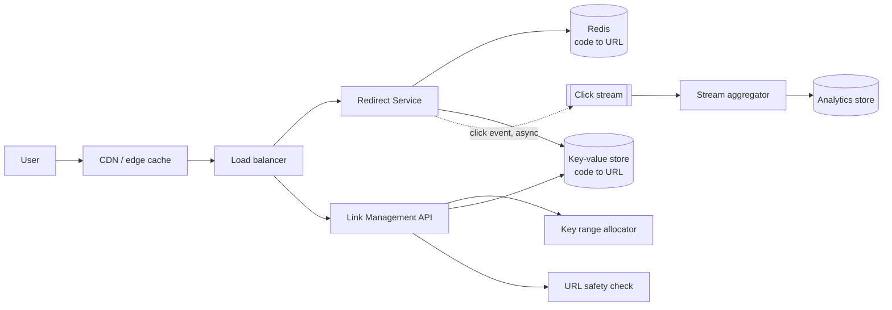
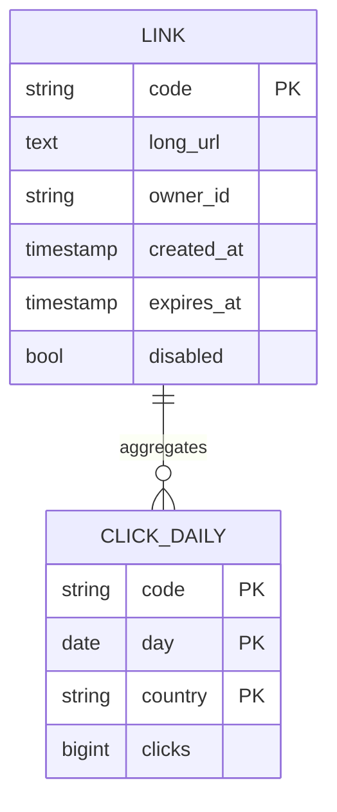

# URL Shortener — Reference System Design

> Reference system design inspired by publicly known product requirements of link-shortening services.

**Author:** Shiv Kumar · [GitHub](https://github.com/shivkumarsinghsky)

## Requirements

Create short aliases for long URLs and redirect quickly. A small problem on the surface, it is a good
vehicle for **key generation**, **read-heavy caching**, **abuse prevention** and **analytics without slowing
the redirect path**.

## Functional Requirements

- Create a short link for a long URL; optional custom alias and expiry.
- Redirect `GET /{code}` to the long URL (301/302).
- Owners can disable links and view click analytics (counts by day, referrer, country).

## Non-Functional Requirements

| Concern | Target |
|---|---|
| Redirect latency | < 20 ms p99 at the service (excluding network) |
| Availability (redirect) | 99.99% — redirects are the product |
| Uniqueness | A code maps to exactly one URL, forever (no reuse after expiry) |
| Analytics | Eventually consistent, minutes are fine |

## Capacity Estimation

Generated by `python -m capacity url-shortener`. Assumptions: 10M DAU, 0.1 links created and 10 redirects per user
per day, ~500 bytes per record.

<!-- capacity:url-shortener:start -->
| Metric | Estimate |
|---|---|
| Daily active users | 10,000,000 |
| Write QPS (avg / peak) | 12/s / 35/s |
| Read QPS (avg / peak) | 1.2K/s / 3.5K/s |
| Read:write ratio | 100:1 |
| New data per day | 500.0 MB |
| Stored data (1825 days, RF=3) | 2.7 TB |
| Ingress (avg) | 46.3 Kbps |
| Egress (avg / peak) | 4.6 Mbps / 13.9 Mbps |
<!-- capacity:url-shortener:end -->

**Key space.** Base62 with 7 characters gives 62⁷ ≈ 3.5 × 10¹² codes. At ~1M new links/day that lasts far
longer than any realistic horizon, so 7 characters are sufficient.

## High-Level Architecture



### Key generation options

| Option | How | Trade-off |
|---|---|---|
| Hash of URL (truncated) | `base62(sha256(url))[:7]` | Collisions must be detected and resolved; same URL → same code (may be undesirable) |
| Global counter + base62 | Single sequence | Simple, but a central bottleneck and codes are guessable |
| **Range allocation (chosen)** | Each API node leases a block of 10K ids from a coordinator, encodes `base62(id)`, optionally permuted | No per-request coordination; ids lost on crash are harmless gaps |

Permuting the id (e.g. a format-preserving bijection) prevents trivial enumeration of sequential codes.

## API Design

```http
POST /v1/links
Idempotency-Key: 5d1c...
{ "url": "https://example.com/very/long/path", "alias": "launch", "expiresAt": "2027-01-01T00:00:00Z" }
-> 201 { "code": "launch", "shortUrl": "https://sho.rt/launch" }

GET    /{code}                       -> 302 Location: <long url>   (301 only if the link can never change)
GET    /v1/links/{code}/stats?from=2026-01-01&to=2026-01-31
DELETE /v1/links/{code}              # soft-disable; code is never reused
```

302 is the default because it keeps the redirect observable for analytics and allows disabling a link;
301 is cached by browsers indefinitely.

## Data Model



## Caching

- Redirect lookups are ~100:1 reads; a Redis cache with LRU eviction serves the hot set (link popularity is
  heavily skewed). Negative caching for unknown codes with a short TTL protects the DB from scans.
- Edge caching of redirects for public links with short TTL (seconds–minutes) to absorb viral spikes.

## Messaging

- Redirect service emits click events asynchronously (fire-and-forget into a local buffer → stream).
  Losing a small fraction of click events during failures is acceptable; slowing redirects is not.

## Scaling

- Redirect service is stateless; scale horizontally. The KV store partitions naturally by `code`.
- Writes are low; the allocator coordinator only handles one request per 10K links.

## Reliability

- Multi-AZ KV store; cache is an optimisation, not the source of truth.
- Redirect falls back to DB on cache miss/failure with a tight timeout; serve a friendly error page rather than hang.
- Idempotent create: repeating the same `Idempotency-Key` returns the original code.

## Security

- Malicious URL screening (safe-browsing lists) at creation and periodically for existing links.
- Rate limits on creation per user/IP; CAPTCHA for anonymous creation.
- Only `http`/`https` schemes allowed; reject `javascript:` and data URLs.
- Custom aliases checked against a reserved/offensive word list.

## Observability

- Redirect latency histogram, cache hit ratio, 404 rate (possible enumeration), creation rate anomalies.

## Trade-offs

| Decision | Benefit | Cost |
|---|---|---|
| Range-allocated ids | No hot coordinator, no collisions | Gaps in id space; codes not content-derived |
| 302 by default | Analytics + revocability | Each click reaches the service |
| Lossy async analytics | Redirect path stays fast | Click counts are approximate under failure |

Related: [File Storage](08-file-storage.md) · [E-Commerce](10-e-commerce.md)
