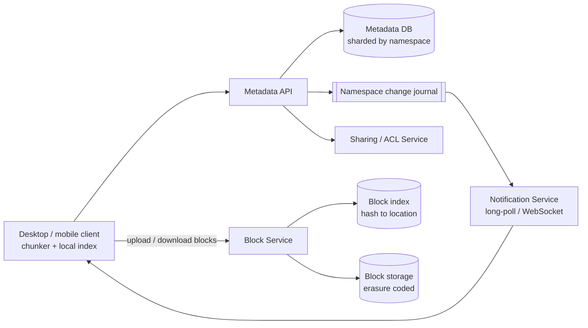
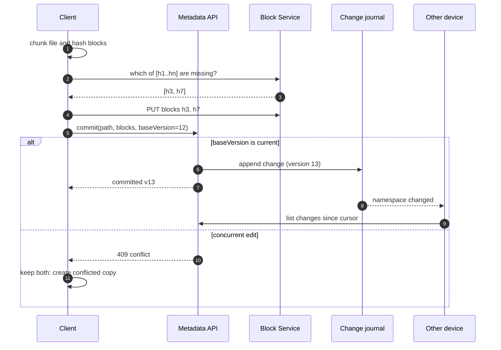
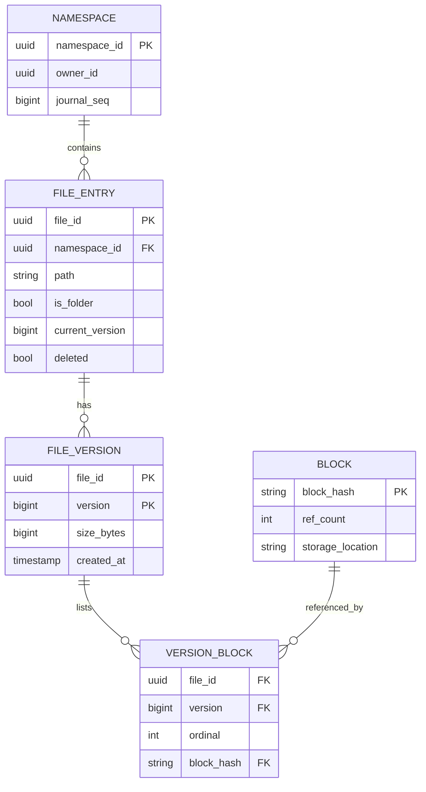

# File Storage and Sync Service — Reference System Design

> Reference system design inspired by publicly known product requirements of cloud file storage and sync
> products. It is not a description of any company's internal architecture.

**Author:** Shiv Kumar · [GitHub](https://github.com/shivkumarsinghsky)

## Requirements

Users store files in the cloud and keep them in sync across devices, and can share files and folders.
Core problems: **efficient upload of large/changed files**, **metadata consistency**, **sync conflict
handling** and **durable, cost-efficient storage**.

## Functional Requirements

- Upload, download, rename, move and delete files and folders.
- Sync changes to all of a user's devices; offline edits reconcile when back online.
- File version history (restore previous versions for N days).
- Share with users (viewer/editor) or via link.

## Non-Functional Requirements

| Concern | Target |
|---|---|
| Durability | ≥ 11 nines for stored content |
| Consistency | Metadata strongly consistent per namespace (a user's tree); content immutable |
| Sync latency | Remote change visible on other online devices within seconds |
| Efficiency | Re-uploading a 1 GB file with a small edit transfers only changed blocks |

## Capacity Estimation

Generated by `python -m capacity file-storage`. Assumptions: 20M DAU, 2 file writes and 5 reads per user per
day, ~1 MB average write after block-level deduplication, replication factor 1 in the model (durability
comes from erasure coding, below).

<!-- capacity:file-storage:start -->
| Metric | Estimate |
|---|---|
| Daily active users | 20,000,000 |
| Write QPS (avg / peak) | 463/s / 1.4K/s |
| Read QPS (avg / peak) | 1.2K/s / 3.5K/s |
| Read:write ratio | 2:1 |
| New data per day | 40.0 TB |
| Stored data (1825 days, RF=1) | 73.0 PB |
| Ingress (avg) | 3.7 Gbps |
| Egress (avg / peak) | 9.3 Gbps / 27.8 Gbps |
<!-- capacity:file-storage:end -->

Erasure coding (e.g. 6 data + 3 parity fragments) gives ~1.5× raw overhead instead of 3× for triple
replication, while tolerating the loss of any three fragments. Applied to the table above, raw capacity is
roughly 1.5× the stored-data figure — a large cost difference at petabyte scale.

## High-Level Architecture



### Content-addressed blocks

1. The client splits a file into blocks (fixed 4 MB or content-defined chunking for better dedupe on inserts).
2. It hashes each block (SHA-256) and asks the Block Service which hashes are **missing**.
3. Only missing blocks are uploaded. Identical blocks across versions or users are stored once.
4. The client then commits a new file version to the Metadata API: `path → [blockHash...]`.



## API Design

```http
POST /v1/blocks/missing        { "hashes": ["…", "…"] } -> { "missing": ["…"] }
PUT  /v1/blocks/{sha256}       (body = block bytes; server verifies hash)
GET  /v1/blocks/{sha256}
POST /v1/files/commit          { "path": "/docs/a.pdf", "blocks": [...], "baseVersion": 12 }
GET  /v1/changes?cursor=...    # incremental sync feed for a namespace
GET  /v1/files/{fileId}/versions
POST /v1/shares                { "path": "/docs", "principal": "u_2", "role": "editor" }
```

## Data Model



## Caching

- Clients keep a local index of block hashes, so most "missing" checks are answered locally.
- Hot metadata (folder listings for active namespaces) cached; the change journal is the invalidation source.
- Downloads of shared, popular files can be fronted by a CDN with signed URLs.

## Messaging

- Per-namespace change journal (monotonic sequence) drives sync. Clients hold a cursor and pull deltas.
- Notification service only signals "something changed" — the client always pulls the authoritative delta.

## Scaling

- Metadata sharded by namespace id; a namespace's writes go to one shard for strong consistency.
- Block storage scales independently; block index is a large KV store partitioned by hash prefix.
- Garbage collection of unreferenced blocks runs asynchronously with a grace period.

## Reliability

- Optimistic concurrency on commit (`baseVersion`), conflicted copies instead of silent overwrite.
- Block upload verified by hash on the server; corrupt blocks rejected.
- Background scrubbing detects bit rot and repairs from parity fragments.

## Security

- Encryption at rest (per-block keys wrapped by a KMS) and TLS in transit.
- Block-level dedupe across users can leak "this file exists" — limit cross-user dedupe or use per-tenant
  convergent keys depending on the threat model.
- ACL checks on every metadata read and on block download (blocks are fetched via short-lived tokens).

## Observability

- Sync lag (commit → other device pulled), dedupe ratio, missing-block ratio, GC backlog, scrub repair rate.

## Trade-offs

| Decision | Benefit | Cost |
|---|---|---|
| Content-addressed blocks | Dedupe, delta upload, immutability | Reference counting and GC complexity |
| Erasure coding | ~1.5× vs 3× storage | Higher CPU and reconstruction latency on failure |
| Pull-based sync with signal | Simple, correct | Extra round trip after each signal |
| Conflicted copies | No data loss | Users must reconcile manually |

Related: [Video Sharing](01-video-sharing-platform.md) · [URL Shortener](07-url-shortener.md)
