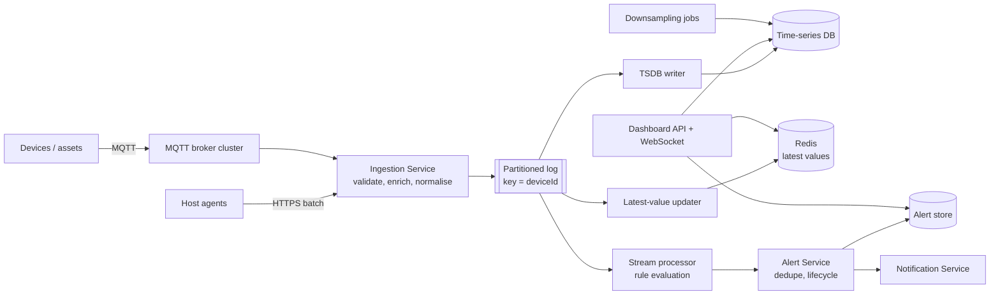
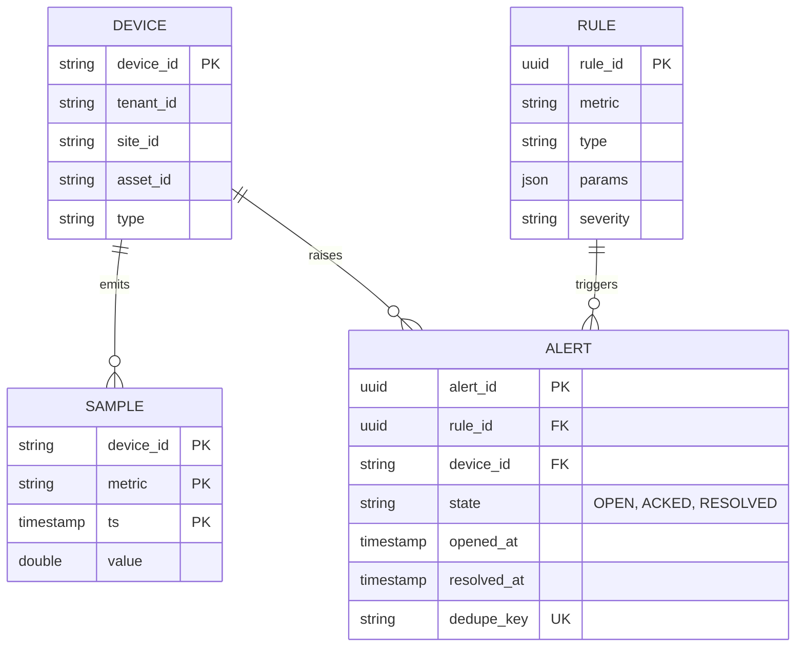

# Real-Time Monitoring Platform — Reference System Design

> Reference system design for telemetry and infrastructure/asset monitoring, based on common industry
> requirements. It is not a description of any specific vendor's architecture.

**Author:** Shiv Kumar · [GitHub](https://github.com/shivkumarsinghsky) ·
Deep dive with runnable code: [realtime-monitoring-platform](https://github.com/shivkumarsinghsky/realtime-monitoring-platform)

## Requirements

Ingest telemetry from IoT devices, industrial assets and servers; evaluate alert rules in near real time;
store time series for dashboards and analysis. The challenge is **sustained high write throughput**,
**low-latency rule evaluation**, **late/out-of-order data** and **alert noise control**.

## Functional Requirements

- Devices publish measurements over MQTT (and agents over HTTP).
- Rule types: threshold, rate-of-change, absence of data (heartbeat), composite rules.
- Alert lifecycle: open → acknowledged → resolved, with deduplication and notification.
- Live dashboards (latest values, charts) and historical queries with downsampling.
- Device registry with metadata (site, asset, type) used to enrich and filter telemetry.

## Non-Functional Requirements

| Concern | Target |
|---|---|
| Ingest throughput | 100K+ samples/s sustained, horizontally scalable |
| Detection latency | < 5 s from sample arrival to alert open |
| Data loss | No loss after broker acknowledgement |
| Query latency | Dashboards < 1 s for 24 h windows |
| Retention | Raw 30 days; 1-minute rollups 1 year; 1-hour rollups 5 years |

## Capacity Estimation

Generated by `python -m capacity monitoring`. Assumptions: 1M monitored devices, one sample every 10 s,
~200 bytes per sample (before compression), raw retention 30 days, replication factor 2.

<!-- capacity:monitoring:start -->
| Metric | Estimate |
|---|---|
| Daily active users | 1,000,000 |
| Write QPS (avg / peak) | 100.0K/s / 150.0K/s |
| Read QPS (avg / peak) | 579/s / 868/s |
| Read:write ratio | 1:173 |
| New data per day | 1.7 TB |
| Stored data (30 days, RF=2) | 103.7 TB |
| Ingress (avg) | 160.0 Mbps |
| Egress (avg / peak) | 92.6 Mbps / 138.9 Mbps |
<!-- capacity:monitoring:end -->

Time-series compression (delta-of-delta timestamps, XOR floats) commonly reduces storage by an order of
magnitude, so the raw figure above is an upper bound. Write rate, not storage, drives the design.

## High-Level Architecture



- **Partition by device id** so all samples for a device go to the same partition and rule state for that
  device lives in one processor instance (no distributed state for per-device rules).
- **Stream processor** keeps small per-device state (last value, sliding windows, last-seen time) in memory
  with periodic checkpoints; heartbeat rules use timers.
- **Separate consumers** for storage, rules and latest-value cache: a slow TSDB does not delay alerting.

## API Design

```http
# Device telemetry (MQTT topic convention)
telemetry/{tenantId}/{deviceId}            payload: {"ts":1717000000123,"metrics":{"temp":71.2,"vibration":0.03}}

GET  /v1/devices/{deviceId}/latest
GET  /v1/devices/{deviceId}/series?metric=temp&from=...&to=...&step=60s
POST /v1/rules                             { "metric": "temp", "type": "threshold", "op": ">", "value": 90, "for": "30s" }
GET  /v1/alerts?state=OPEN&site=...
POST /v1/alerts/{alertId}/ack
WS   /v1/stream?devices=...                # live updates for dashboards
```

## Data Model



## Caching

- Latest value per (device, metric) in Redis — dashboards read this instead of querying the TSDB.
- Device registry cached in the ingestion service for enrichment (refreshed on registry change events).

## Messaging

- MQTT QoS 1 from devices (at-least-once); ingestion dedupes on `(deviceId, ts, metric)` where needed.
- Kafka-style log with retention of several days allows replay into new consumers (e.g. a new rule engine).

## Scaling

- Brokers and ingestion scale horizontally; the log scales by partitions (plan for partition count growth).
- TSDB scales by sharding on series key; rollups reduce the data read by long-range queries.
- Hot devices are rare in telemetry (rates are bounded by device firmware), so key skew is manageable.

## Reliability

- **Back-pressure**: if TSDB writes slow down, the log buffers; consumers catch up. Alerting is unaffected.
- **Late data**: rules use event time with an allowed-lateness window; samples older than the window are
  stored but do not re-trigger alerts.
- **Alert flapping**: hysteresis (separate open/close thresholds) and `for` durations reduce noise.
- Dead-letter topic for malformed payloads, with counts per device to detect firmware issues.

## Security

- Per-device credentials (X.509 client certs or tokens) and topic ACLs: a device may only publish to its
  own topic. Tenant id is derived from the credential, never trusted from the payload.
- TLS on MQTT; dashboard APIs behind OIDC with tenant-scoped authorization.

## Observability

- Monitor the monitor: ingest rate per tenant, consumer lag per consumer group, rule evaluation latency,
  alert open-to-notify latency, and a heartbeat "canary device".

## Trade-offs

| Decision | Benefit | Cost |
|---|---|---|
| Partition by device id | Local per-device rule state | Cross-device rules need a second stage |
| Separate consumer groups | Failure isolation | Data read several times from the log |
| Latest values in Redis | Fast dashboards | Another store to keep consistent |
| Event-time + lateness window | Correct ordering semantics | Delays some alerts by the window |

Related: [Notification System](06-notification-system.md) · [Multi-Tenant SaaS](11-multi-tenant-saas.md)
