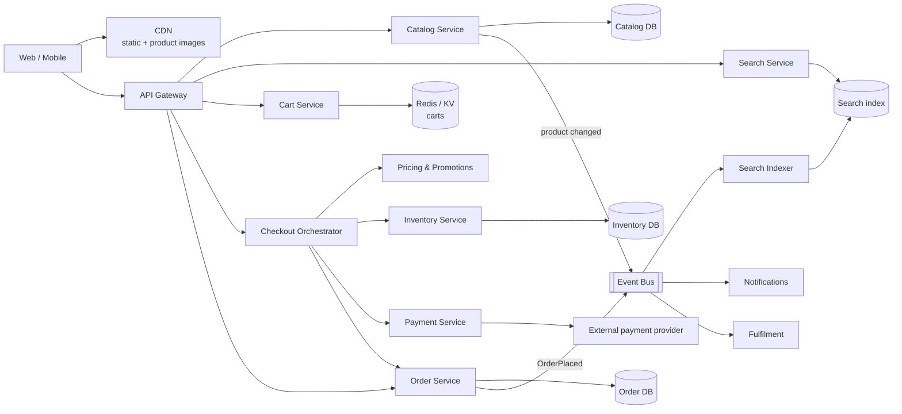
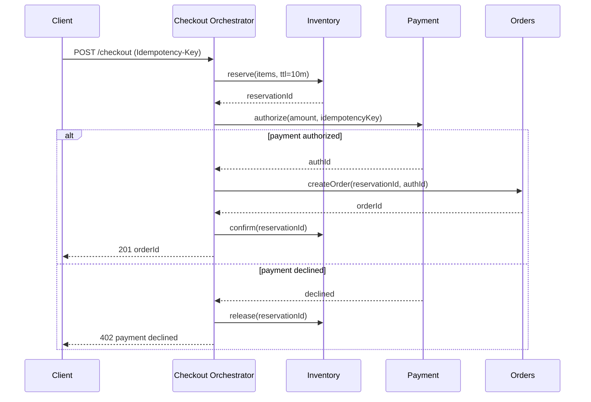
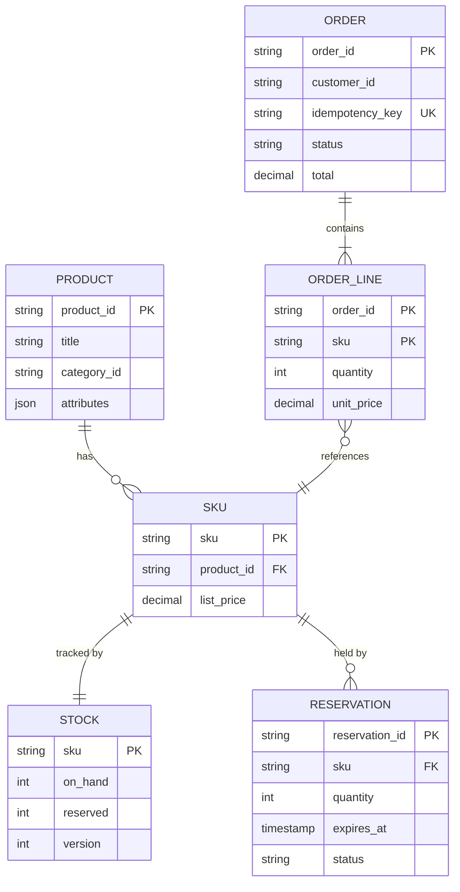

# E-Commerce Platform — Reference System Design

> Reference system design inspired by publicly known product requirements of online retail products.
> It is not a description of any company's internal architecture.

**Author:** Shiv Kumar · [GitHub](https://github.com/shivkumarsinghsky)

## Requirements

A catalogue-driven store where shoppers browse, search, add items to a cart and check out. The interesting
problems are **inventory correctness under contention**, **a checkout that spans several services**, and
**flash-sale traffic that is an order of magnitude above normal**.

## Functional Requirements

- Browse and search a product catalogue (categories, facets, price, availability).
- Cart for anonymous and signed-in users; cart merge on sign-in.
- Checkout: price the cart, reserve stock, take payment, create the order.
- Order history, cancellation before shipment, returns.
- Seller/merchandiser tools to manage products, prices and stock.

Out of scope: marketplace payouts, ad placement, warehouse robotics.

## Non-Functional Requirements

| Concern | Target |
|---|---|
| Catalogue / search latency | < 200 ms p95 |
| Checkout latency | < 2 s p95 end-to-end, including payment provider |
| Inventory | Never sell stock that does not exist (no oversell beyond a configured buffer) |
| Orders | Exactly-once order creation from the shopper's perspective |
| Availability | Browse 99.95%; checkout 99.9% with graceful degradation |
| Peak | 10× normal traffic during sales events |

## Capacity Estimation

Generated by `python -m capacity e-commerce`. Assumptions: 20M DAU, 30 page/search reads and 0.2 writes
(cart changes, orders, reviews) per user per day, 10× peak for flash sales.

<!-- capacity:e-commerce:start -->
| Metric | Estimate |
|---|---|
| Daily active users | 20,000,000 |
| Write QPS (avg / peak) | 46/s / 463/s |
| Read QPS (avg / peak) | 6.9K/s / 69.4K/s |
| Read:write ratio | 150:1 |
| New data per day | 20.0 GB |
| Stored data (2555 days, RF=3) | 153.3 TB |
| Ingress (avg) | 1.9 Mbps |
| Egress (avg / peak) | 2.8 Gbps / 27.8 Gbps |
<!-- capacity:e-commerce:end -->

The read path dominates and is highly cacheable. The write path is small in volume but is where
correctness matters, so the design spends its complexity budget there.

## High-Level Architecture



### Checkout as a saga

Checkout touches pricing, inventory, payment and orders, each owning its own data. A distributed transaction
across them is neither available nor desirable, so the checkout orchestrator runs a **saga** with compensations.



Orchestration (rather than choreography) is used here because the flow is short, linear and needs a single place
to answer "what state is this checkout in?". See [ADR-003](../decisions/ADR-003-saga-orchestration-for-checkout.md).

## API Design

```http
GET  /v1/products?category=shoes&size=42&sort=price_asc&cursor=...
GET  /v1/products/{sku}
PUT  /v1/carts/{cartId}/items/{sku}      { "quantity": 2 }
POST /v1/checkout
Idempotency-Key: 9b2f...
{ "cartId": "c_123", "shippingAddressId": "a_9", "paymentMethodId": "pm_1" }
-> 201 { "orderId": "o_789", "status": "CONFIRMED" }
GET  /v1/orders/{orderId}
POST /v1/orders/{orderId}/cancel
```

## Data Model



**Inventory reservation** is a conditional update, so two concurrent checkouts cannot both take the last unit:

```sql
UPDATE stock
   SET reserved = reserved + :qty, version = version + 1
 WHERE sku = :sku AND on_hand - reserved >= :qty;
-- 0 rows updated => insufficient stock
```

Reservations carry an expiry; a sweeper releases expired holds so abandoned checkouts do not lock stock.

## Caching

- Product detail pages and category listings are cached at the CDN and in Redis with event-driven invalidation
  (`ProductChanged`). Price and availability are fetched separately with a short TTL so a cached page never
  shows a stale price at checkout — the checkout always re-prices.
- Availability shown on listing pages is approximate ("in stock" / "low stock"); the reservation is the truth.

## Messaging

- `OrderPlaced`, `OrderCancelled`, `ProductChanged`, `StockAdjusted` events on the bus.
- Order Service writes the order and the `OrderPlaced` event in one local transaction (**transactional outbox**)
  so downstream consumers never miss an order. Consumers are idempotent by `orderId`.

## Scaling

- Catalogue and search scale horizontally behind caches; the search index is sharded by product id and replicated.
- Hot SKUs during flash sales are the bottleneck. Options, from simplest: per-SKU row lock (fine to a few hundred
  writes/s), splitting stock into N buckets that are reserved independently, or a virtual waiting room that
  meters checkout entry.
- Orders partition by `customer_id`; order history queries are per-customer.

## Reliability

- Checkout is idempotent end-to-end: the `Idempotency-Key` is stored with the order; payment authorisation reuses
  it with the provider.
- Calls to the payment provider have a strict timeout and a circuit breaker. On timeout the saga queries the
  provider for the authorisation status before deciding to compensate — never blindly retry a charge.
- If recommendations or reviews are down, product pages render without them (graceful degradation).

## Security

- PCI scope is minimised by tokenising cards with the payment provider; the platform never stores PANs.
- OAuth2/OIDC for shoppers; separate admin identity with MFA for merchandisers.
- Server-side price calculation only — the client never sends prices.
- Rate limiting and bot detection on checkout and inventory endpoints during sales.

## Observability

- Business SLIs alongside technical ones: checkout conversion, payment decline rate, reservation expiry rate,
  oversell count (should be zero).
- Distributed tracing across the checkout saga, keyed by `checkoutId`.

## Trade-offs

| Decision | Benefit | Cost |
|---|---|---|
| Orchestrated saga | One place to see checkout state; explicit compensation | Orchestrator is a critical component |
| Reservation with TTL | No oversell; abandoned carts self-heal | Stock looks unavailable while held |
| Approximate availability on listings | Listings stay cacheable | Rare "sold out at checkout" experience |
| Outbox for order events | No lost events | Extra table and relay process |

Related: [Notification System](06-notification-system.md) · [Multi-Tenant SaaS](11-multi-tenant-saas.md) ·
[microservices-patterns](https://github.com/shivkumarsinghsky/microservices-patterns) (saga, outbox)
