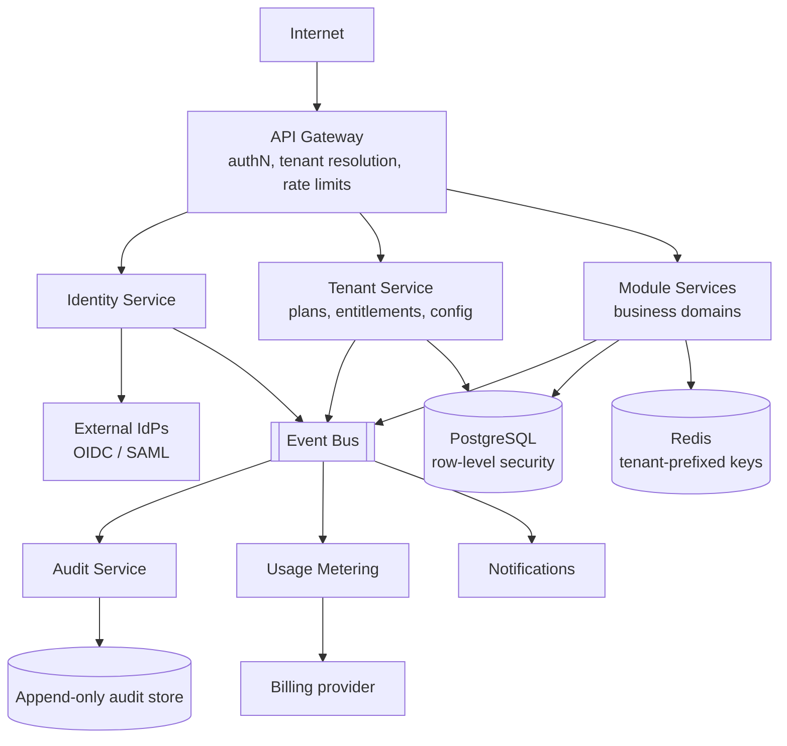
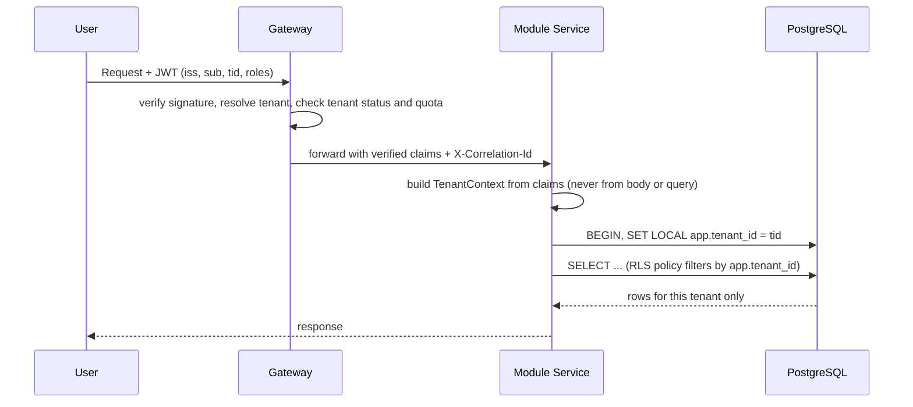
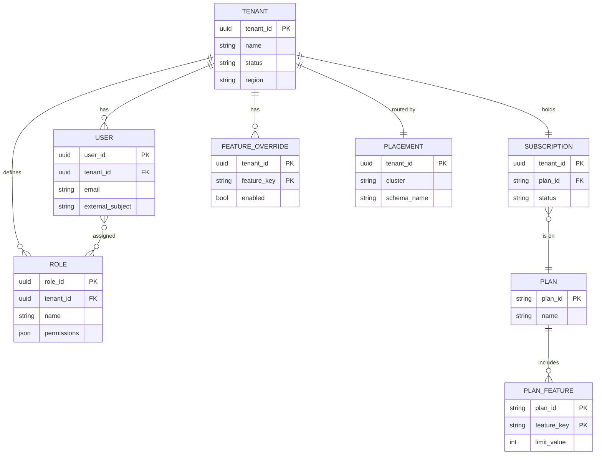

# Multi-Tenant Enterprise SaaS — Reference System Design

> Reference system design for a B2B SaaS product serving many organisations from shared infrastructure.

**Author:** Shiv Kumar · [GitHub](https://github.com/shivkumarsinghsky) ·
Deep dive with runnable code: [enterprise-saas-plateform](https://github.com/shivkumarsinghsky/enterprise-saas-plateform)

## Requirements

Serve thousands of customer organisations (tenants) — from 5-user teams to 50,000-seat enterprises — from one
platform. The defining concerns are **tenant isolation**, **per-tenant configuration and entitlements**,
**noisy-neighbour control**, and the ability to give a large customer **dedicated resources without a fork**.

## Functional Requirements

- Tenant onboarding: create tenant, admin user, default roles, subscription plan.
- Identity: local users and enterprise SSO (OIDC/SAML) per tenant; SCIM provisioning.
- Role-based access control with tenant-defined custom roles.
- Feature/module entitlements driven by subscription plan plus per-tenant overrides.
- Audit log of security-relevant and business-relevant actions, exportable by tenant admins.
- Usage metering for billing.

## Non-Functional Requirements

| Concern | Target |
|---|---|
| Isolation | No cross-tenant data access, verified by automated tests and enforced at the database |
| Latency | < 300 ms p95 for interactive APIs |
| Availability | 99.9% per tenant per month |
| Noisy neighbour | One tenant cannot consume more than its quota of shared capacity |
| Data residency | Tenant data pinned to a region chosen at onboarding |
| RPO / RTO | 15 min / 4 h for the shared tier; contractual for dedicated tier |

## Capacity Estimation

Generated by `python -m capacity multi-tenant-saas`. Assumptions: 500K daily users across all tenants, chatty
business UI (300 reads, 50 writes per user per day), business-hours peak of 4×.

<!-- capacity:multi-tenant-saas:start -->
| Metric | Estimate |
|---|---|
| Daily active users | 500,000 |
| Write QPS (avg / peak) | 289/s / 1.2K/s |
| Read QPS (avg / peak) | 1.7K/s / 6.9K/s |
| Read:write ratio | 6:1 |
| New data per day | 50.0 GB |
| Stored data (2555 days, RF=3) | 383.2 TB |
| Ingress (avg) | 4.6 Mbps |
| Egress (avg / peak) | 138.9 Mbps / 555.6 Mbps |
<!-- capacity:multi-tenant-saas:end -->

Average load is modest; the challenge is the **skew** — the top 1% of tenants often produce the majority of load.

## High-Level Architecture



### Tenant context propagation



## Tenancy Models

| Model | Isolation | Cost / tenant | Operations | Fits |
|---|---|---|---|---|
| Shared DB, shared schema (`tenant_id` + RLS) | Logical | Lowest | One schema to migrate | Long tail of small/medium tenants |
| Shared DB, schema per tenant | Logical, stronger blast-radius | Medium | Migrations × N schemas; catalogue bloat past ~1K schemas | Hundreds of mid-size tenants |
| Database per tenant | Physical | Highest | Fleet management, per-tenant backups | Regulated or very large tenants |

The recommended approach is a **hybrid with a tenant routing table**: every tenant has a `placement` record
pointing to a database cluster (and optionally a schema). Most tenants share a pooled cluster; a tenant can be
moved to a dedicated cluster without code changes because services resolve connections through placement.

## API Design

```http
POST /v1/tenants                              # platform admin only
{ "name": "Acme", "plan": "enterprise", "region": "eu-west", "adminEmail": "it@acme.example" }

GET  /v1/tenants/current/entitlements         # modules + limits for the caller's tenant
POST /v1/users                                # tenant admin; tenant taken from token
POST /v1/roles  { "name": "Planner", "permissions": ["workorders:read", "workorders:write"] }
GET  /v1/audit-events?from=2026-01-01&actor=u_42&cursor=...
```

Tenant id is **never** a path or body parameter on tenant-scoped APIs; it comes from the verified token.
Platform-level APIs that operate across tenants live on a separate, separately authenticated surface.

## Data Model



## Caching

- Entitlements and role→permission maps are cached per tenant (Redis + small in-process LRU), invalidated by
  `TenantPlanChanged` / `RoleChanged` events. TTL bounds staleness if an event is missed.
- Every cache key is prefixed with tenant id (`t:{tenantId}:...`); a shared helper builds keys so no call site
  can forget the prefix.

## Messaging

- Every event envelope carries `tenantId`, `correlationId`, `actorId`. Consumers re-establish tenant context from
  the envelope before touching data.
- Partition key is `tenantId` so one tenant's events are ordered and a burst from one tenant is confined to a
  subset of partitions.

## Scaling

- Stateless services scale horizontally; per-tenant rate limits and concurrency limits at the gateway protect the
  shared pool.
- Database: pooled clusters sized by tenant count and load; large tenants are promoted to dedicated clusters via
  the placement table. Read replicas for reporting.
- Background jobs use per-tenant fair queuing so one tenant's bulk import does not starve others.

## Reliability

- Backups: continuous WAL archiving for pooled clusters (point-in-time restore). Restoring **one tenant** from a
  pooled backup requires a restore-to-side then copy-by-tenant-id procedure — rehearsed, scripted and tested.
- Region-level DR: warm standby in a paired region within the same residency boundary.
- A tenant can be suspended (read-only) without affecting others.

## Security

- Defence in depth for isolation: token-derived tenant context → repository filters → PostgreSQL row-level security.
  Any one layer failing does not leak data.
- Tenant-aware authentication: issuer and allowed IdPs are configured per tenant; tokens from tenant A's IdP are
  rejected for tenant B.
- RBAC with permission strings, evaluated server-side; tenant admins cannot grant permissions outside their plan.
- Per-tenant encryption keys (envelope encryption) for sensitive fields in the enterprise tier.
- Audit log is append-only and written through the event bus so services cannot silently skip it.

## Observability

- Every log line, metric and trace carries `tenant_id` (as a log field and trace attribute; as a metric label only
  for bounded "top-N tenant" metrics to avoid cardinality explosions).
- Per-tenant SLO dashboards for enterprise customers; noisy-neighbour detection via per-tenant resource usage.

## Trade-offs

| Decision | Benefit | Cost |
|---|---|---|
| Pooled RLS by default | Cheap per tenant; one migration path | Isolation depends on correct policies (mitigated by tests) |
| Placement table | Move tenants between tiers without code change | One more lookup on the hot path (cached) |
| Tenant id only from token | Removes a whole class of IDOR bugs | Cross-tenant admin features need a separate API surface |
| Tenant-partitioned events | Per-tenant ordering, blast-radius control | Hot tenants create hot partitions |

Related: [Enterprise AI Platform](12-enterprise-ai-platform.md) · [E-Commerce](10-e-commerce.md) ·
[enterprise-saas-plateform](https://github.com/shivkumarsinghsky/enterprise-saas-plateform)
