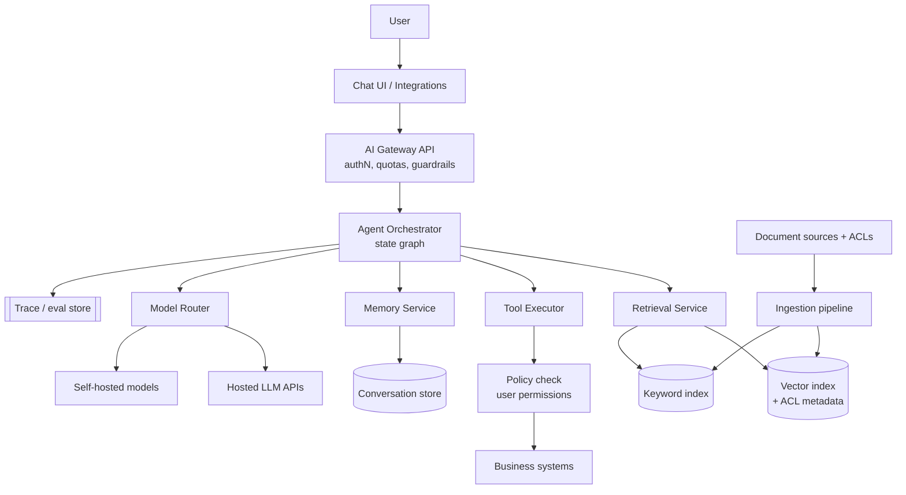
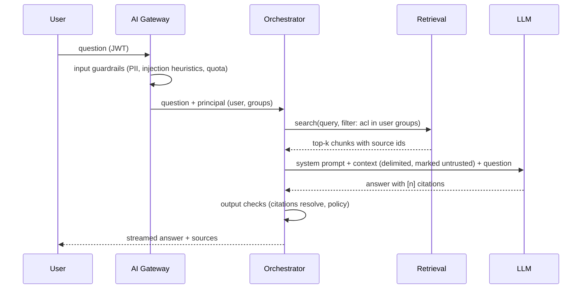
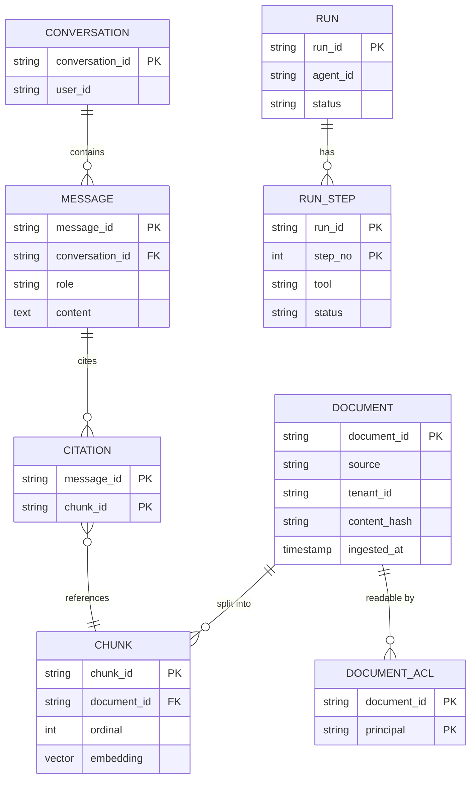

# Enterprise AI Platform — Reference System Design

> Reference system design for an internal assistant / agent platform that answers questions over company data
> and performs actions through approved tools.

**Author:** Shiv Kumar · [GitHub](https://github.com/shivkumarsinghsky) ·
Deep dives with runnable code: [rag-enterprise-assistant](https://github.com/shivkumarsinghsky/rag-enterprise-assistant) ·
[enterprise-ai-agent-plateform](https://github.com/shivkumarsinghsky/enterprise-ai-agent-plateform)

## Requirements

Give employees a conversational interface that (a) answers questions grounded in company documents with
citations and (b) can call business systems (ticketing, reporting, asset management) on the user's behalf.
The hard parts are **permission-aware retrieval**, **controlling what an LLM is allowed to do**, **evaluating
non-deterministic output**, and **cost/latency management**.

## Functional Requirements

- Ingest documents from approved sources (file shares, wikis, ticketing) with their access-control lists.
- Chat with retrieval-augmented answers and inline citations.
- Agents that call registered tools; destructive tools require human approval.
- Conversation history and per-user memory with retention controls.
- Admin console: tool registry, model routing, usage and cost per department.

## Non-Functional Requirements

| Concern | Target |
|---|---|
| Authorisation | A user can never receive content they cannot open in the source system |
| Time to first token | < 1.5 s p95 for chat |
| Groundedness | Answers cite sources; "I don't know" preferred over unsupported claims |
| Auditability | Every prompt, retrieval set, tool call and response is traceable |
| Cost | Budget per department with alerts and hard limits |

## Capacity Estimation

Generated by `python -m capacity enterprise-ai`. Assumptions: 100K daily users, 20 prompts each, ~20 KB stored
per interaction (prompt, retrieved context, response, trace).

<!-- capacity:enterprise-ai:start -->
| Metric | Estimate |
|---|---|
| Daily active users | 100,000 |
| Write QPS (avg / peak) | 23/s / 93/s |
| Read QPS (avg / peak) | 23/s / 93/s |
| Read:write ratio | 1:1 |
| New data per day | 40.0 GB |
| Stored data (365 days, RF=3) | 43.8 TB |
| Ingress (avg) | 3.7 Mbps |
| Egress (avg / peak) | 740.7 Kbps / 3.0 Mbps |
<!-- capacity:enterprise-ai:end -->

QPS is low by web standards. The constraints are **LLM tokens per minute**, **GPU or provider quota** and
**cost**, not request throughput — so the design focuses on routing, caching and budget enforcement.

## High-Level Architecture



### Request flow with permission-aware retrieval



## API Design

```http
POST /v1/conversations                      -> { "conversationId": "c_1" }
POST /v1/conversations/{id}/messages        (SSE stream)
{ "content": "What is the PM interval for pump P-101?", "mode": "rag" }

POST /v1/agents/{agentId}/runs              { "input": "...", "conversationId": "c_1" }
GET  /v1/runs/{runId}                       -> status, steps, pending approvals
POST /v1/runs/{runId}/approvals/{stepId}    { "decision": "approve" }
```

## Data Model



## Caching

- Embedding cache keyed by content hash — re-ingesting unchanged documents costs nothing.
- Semantic answer cache only for public, non-personalised corpora; never for ACL-filtered content unless the
  cache key includes the effective permission set.
- Provider prompt caching for long, stable system prompts.

## Messaging

- Ingestion is event-driven: source change → `DocumentChanged` → parse → chunk → embed → upsert, with retries and a
  dead-letter queue for unparsable files.
- ACL changes are processed with higher priority than content changes; revoking access must propagate quickly.

## Scaling

- The orchestrator is stateless between steps; run state is checkpointed so long agent runs survive restarts and
  can pause for human approval.
- The model router chooses the cheapest model that meets the task's quality bar and falls back across providers on
  rate limits.
- Vector index partitioned by tenant/business unit; hybrid (vector + keyword) retrieval with re-ranking.

## Reliability

- Every LLM and tool call has a timeout and bounded retries; agent graphs have a maximum step count to stop loops.
- If retrieval fails, the assistant says so rather than answering from model memory.
- Degradation ladder: primary model → secondary model → retrieval-only answer (show top sources) → error.

## Security

- **Prompt injection:** retrieved content and tool output are treated as untrusted data, delimited in the prompt,
  and can never grant new permissions. Tool authorisation is enforced in code against the *user's* permissions,
  not the model's request.
- Tools are allow-listed per agent with typed input schemas; write tools require approval.
- PII redaction on logs; data processed by external providers governed by contract and region.

## Observability

- A trace per request: prompt version, model, retrieved chunk ids, tool calls, tokens, latency, cost.
- Offline evaluation suites (retrieval hit rate, answer groundedness, refusal correctness) run on every prompt or
  model change; online feedback (thumbs up/down) sampled into review queues.

## Trade-offs

| Decision | Benefit | Cost |
|---|---|---|
| ACL filter at retrieval time | Simple, correct permissions | Requires ACL sync from every source |
| Graph-based orchestrator | Explicit, testable control flow; resumable | Less "autonomous" than free-form agents |
| Human approval for write tools | Safety and accountability | Slower for routine actions |
| Multi-model router | Cost control, provider resilience | Behaviour varies across models; more evaluation work |

Related: [Multi-Tenant SaaS](11-multi-tenant-saas.md) · [Real-Time Monitoring](09-real-time-monitoring.md)
