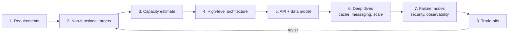

# A Repeatable Method for System Design

Every design in this repository follows the same sequence. The order matters: each step constrains the next,
and skipping ahead (for example choosing a database before agreeing on the access patterns) is the most common
source of designs that look plausible but do not hold up under review.

## 1. Requirements

State what the system does and — just as important — what it does **not** do. An explicit "out of scope" list
prevents the design from growing until it is unreviewable.

## 2. Non-functional targets

Write numbers, not adjectives. "Fast" cannot be designed for; "p99 < 200 ms for feed reads" can. The targets
that usually shape an architecture are:

| Target | Typical driver of architecture |
|---|---|
| Latency percentile | Caching, data locality, synchronous vs. asynchronous paths |
| Availability | Redundancy, failure domains, degradation strategy |
| Consistency | Choice of datastore, transaction boundaries, conflict handling |
| Durability (RPO) | Replication mode, backup cadence |
| Recovery (RTO) | Standby strategy, automation |
| Throughput / peak factor | Partitioning, autoscaling, admission control |

## 3. Capacity estimate

Estimates are generated by [`tools/capacity`](../../tools/capacity) so the assumptions are explicit and
reproducible. The point is order-of-magnitude: is this 100 QPS (one database) or 1M QPS (partitioned everything)?

## 4. High-level architecture

Draw the request path first, then the asynchronous paths. Every box should have a single sentence describing
its responsibility; if it needs two sentences, it is probably two components.

## 5. API and data model

Design APIs around client use cases, not tables. Derive the data model from access patterns: list the top
queries, then choose keys and indexes that serve them.

## 6. Deep dives

Pick the two or three components where the system is actually hard (the hot partition, the fan-out, the
exactly-once requirement) and spend the time there.

## 7. Failure modes, security, observability

For every dependency ask: *what happens when it is slow, down, or returns garbage?* Then make sure there is a
signal that tells an operator it is happening.

## 8. Trade-offs

Every design decision gives something up. Recording the cost next to the benefit is what turns a diagram into an
architecture.

Next: [Building Blocks](02-building-blocks.md)
