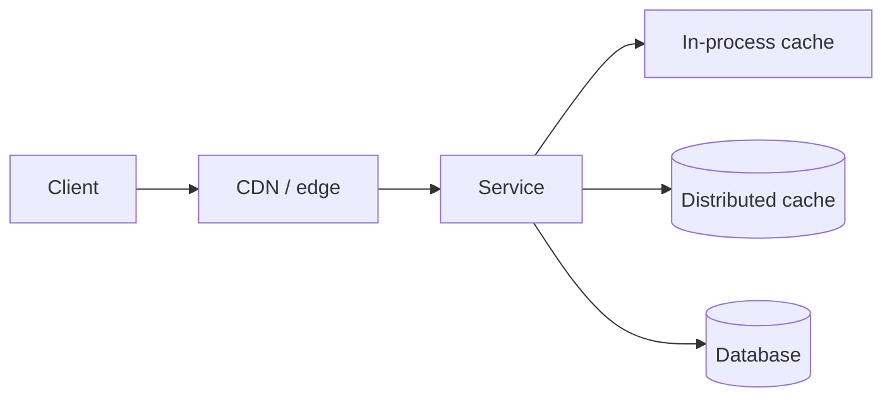

# Scalability Building Blocks

A short reference of the components that recur in every design, with the questions to ask before using each.

## Load balancing

| Layer | Examples | Use when |
|---|---|---|
| L4 (TCP) | Cloud NLB, IPVS | Long-lived connections (WebSocket, MQTT), very high throughput |
| L7 (HTTP) | Nginx, Envoy, cloud ALB | Path/host routing, retries, header-based routing, TLS termination |
| Client-side | gRPC client LB, service mesh | Service-to-service calls inside a cluster |

Algorithms: round-robin for uniform requests; least-connections for variable request cost; consistent hashing
when the backend holds per-key state (caches, WebSocket sessions).

## Caching

| Strategy | Read path | Write path | Watch out for |
|---|---|---|---|
| Cache-aside | Read cache, on miss read DB and populate | Write DB, delete cache key | Thundering herd on hot-key expiry |
| Read-through | Cache loads from DB itself | Same as cache-aside | Needs a cache that supports loaders |
| Write-through | Always hits cache | Write cache and DB synchronously | Write latency |
| Write-behind | Always hits cache | Write cache, flush DB async | Data loss on cache failure |

Invalidation is the hard part. Prefer **delete-on-write + TTL** over update-on-write; use request coalescing
(single-flight) for hot keys; add jitter to TTLs so keys do not expire together.

## Partitioning (sharding)

| Scheme | Good for | Problem |
|---|---|---|
| Hash of key | Even distribution | Range queries span all shards |
| Range of key | Range scans, time series | Hot spots on the newest range |
| Directory / lookup table | Moving tenants or large keys individually | Extra lookup; directory must be highly available |

Choose the partition key from the **dominant access pattern**. Cross-partition queries should be rare and
served by a secondary system (search index, analytics store), not by scatter-gather on the primary.

## Replication

- **Leader–follower:** simple; reads from followers are eventually consistent (read-your-writes needs routing).
- **Multi-leader:** writes in several regions; requires conflict resolution.
- **Leaderless / quorum:** tunable consistency (`R + W > N`), used by Dynamo-style stores.

## Asynchronous processing

Move work off the request path when the user does not need the result immediately: notifications, indexing,
transcoding, analytics. Queues also absorb bursts so downstream systems can be sized for average, not peak, load.

## Database scaling ladder

1. Index and query tuning.
2. Connection pooling.
3. Read replicas for read-heavy workloads.
4. Caching hot reads.
5. Vertical scaling.
6. Functional partitioning (separate databases per service/domain).
7. Horizontal sharding.

Climb only as far as the capacity estimate requires — each step adds operational cost.

Next: [Consistency and Messaging](03-consistency-and-messaging.md)
