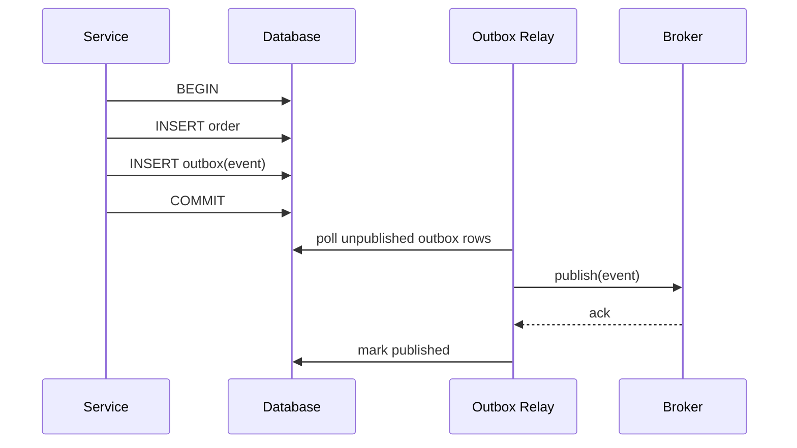

# Consistency and Messaging

## CAP and PACELC, practically

During a network partition a replicated system must choose between rejecting requests (consistency) and serving
possibly stale data (availability). PACELC adds the more common everyday trade-off: **E**lse, when there is no
partition, you trade **L**atency against **C**onsistency.

In practice the question is per operation, not per system:

| Operation | Usually needs | Example |
|---|---|---|
| Money movement, inventory decrement, unique username | Strong consistency (single leader, transaction) | Checkout reservation |
| Feeds, counters, recommendations, search | Eventual consistency | Like counts |
| User's own recent writes | Read-your-writes | Seeing your own post immediately |

## Delivery semantics

| Guarantee | Means | How it is usually achieved |
|---|---|---|
| At-most-once | May lose, never duplicates | Ack before processing |
| At-least-once | Never loses, may duplicate | Ack after processing; retries |
| Effectively-once | Duplicates have no extra effect | At-least-once **plus** idempotent consumers |

"Exactly-once delivery" across a network is not achievable in general; what systems provide is
**effectively-once processing** by combining at-least-once delivery with idempotency (dedup table, natural
idempotency such as `SET status = 'PAID'`, or transactional offsets within one system).

## The dual-write problem and the outbox

Writing to a database and publishing to a broker are two separate systems; one can succeed while the other
fails.

The relay may publish twice (crash after publish, before marking), which is why consumers must be idempotent.

## Ordering

Global ordering does not scale. Most systems need ordering **per entity** (per conversation, per order, per
device). Use the entity id as the partition/routing key so all its events land on one ordered partition, and
include a per-entity sequence number so consumers can detect gaps and reordering.

## Choreography vs. orchestration

| | Choreography | Orchestration |
|---|---|---|
| Control | Each service reacts to events | A coordinator issues commands |
| Coupling | Low between services | Services coupled to the orchestrator's contract |
| Visibility | Flow is implicit, spread across services | Flow is explicit in one place |
| Best for | Simple, few-step reactions; broadcast | Multi-step business processes with compensation |

Next: [Reliability Patterns](04-reliability-patterns.md)
