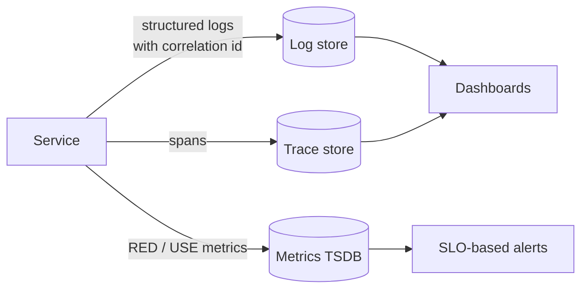

# Reliability, Security and Observability Checklist

These are the cross-cutting concerns applied to every design in this repository.

## Reliability

| Pattern | Problem it addresses | Key parameter |
|---|---|---|
| Timeout | A slow dependency consumes all threads/connections | Set from the dependency's p99 plus margin, never infinite |
| Retry with exponential backoff + jitter | Transient failures | Max attempts; retry only idempotent operations |
| Circuit breaker | Repeatedly calling a failing dependency | Failure-rate threshold, open duration |
| Bulkhead | One dependency exhausting a shared pool | Separate pools/concurrency limits per dependency |
| Idempotency key | Client or broker retries duplicating side effects | Key retention window |
| Dead-letter queue | Poison messages blocking a queue | Max delivery attempts, replay tooling |
| Load shedding / admission control | Overload causing total collapse | Queue depth or latency threshold |
| Graceful degradation | Non-critical feature failure breaking the page | Explicit fallback per feature |

Retry budgets matter: three layers each retrying three times turn one failure into 27 calls. Retry at one layer,
usually the one closest to the caller that understands idempotency.

## Security

- **Authentication** at the edge (OIDC/OAuth2, short-lived JWTs); service-to-service via mTLS or signed tokens.
- **Authorization** in the service that owns the data, not only at the gateway.
- **Input validation** with schemas at every trust boundary.
- **Secrets** from a secret manager or environment injection — never in source control.
- **Rate limiting** per user, per tenant and per IP; stricter on expensive or abusable endpoints.
- **Tenant isolation** enforced at the data layer for multi-tenant systems.

## Observability

- **RED** for services (Rate, Errors, Duration) and **USE** for resources (Utilisation, Saturation, Errors).
- A correlation id generated at the edge and propagated through HTTP headers and message envelopes.
- Liveness probes check the process; readiness probes check that dependencies needed to serve traffic are
  reachable.
- Alert on SLO burn rate, not on individual errors.

Back to: [Design Method](01-design-method.md)
